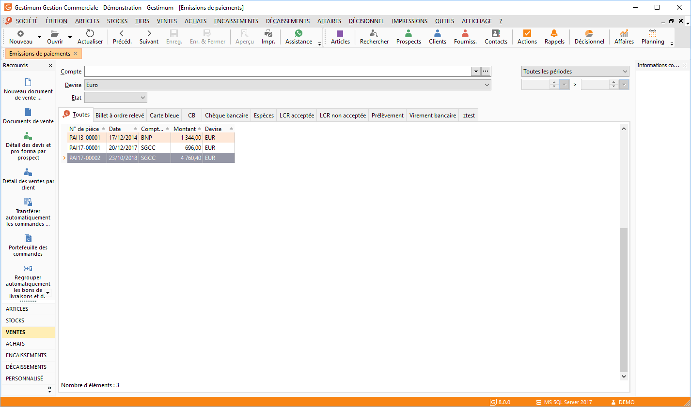

# Emissions de paiements

En gestion commerciale, tant que les écritures de paiements n’ont pas encore été transférées en comptabilité, une remise en banque / émission de paiement peut être modifiée ou supprimée.

 

La gestion des émissions de paiements (création, modification, suppression, impression) s’effectue à partir de la barre d'outils, du menu contextuel ou des raccourcis claviers.

 

Toutes les listes ont un fonctionnement commun.

## Recherche des émissions de paiements

Vous pouvez recherche dans la liste des remises en banque ou émissions de paiements une remise / émission précise.

 

Pour cela des filtres sont disponibles :

* Journal,
* Devise,
* État de la remise (Toutes "champ vide", Non comptabilisées, Comptabilisées),
* Période de réalisation de l'émission des paiements.

## Grille des émissions des paiements effectuées

Les remises en banque ou émissions de paiements sont triées par type de mode de règlement (un onglet par mode de règlement/paiement).

 

Par défaut dans chaque onglet, les remises en banque / émissions des paiements sont triées par numéro de remise mais il est possible de les trier par date de remise, par banque (journal) ou montant.

 

Pour chaque remise, vous obtenez par défaut son numéro, sa date, son journal, sa devise et le montant total de la remise.

 

Pour ouvrir ou modifier une émission de paiements, vous devez double cliquer (ou Ctrl+O ou clic droit + Ouvrir) sur la remise/émission souhaitée.

## Génération d'une remise magnétique (fichier ETEBAC)

A partir du menu contextuel de la liste, vous pouvez réaliser une remise magnétique (fichier ETEBAC) de votre remise en banque/émission des paiements pour les types de règlements/paiements suivants :

* Virement,
* Lettre de Change,
* Billet à ordre,
* Prélèvement.

 

