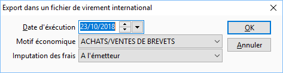
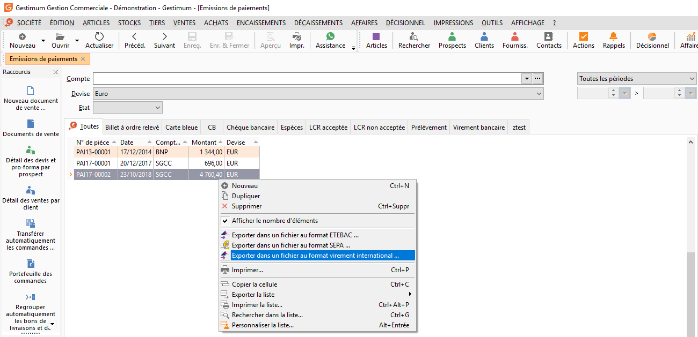

# Fichier bancaire de virement international

Pour faciliter les transactions bancaires avec vos interlocuteurs internationaux, Gestimum a développé la génération des fichiers de virements internationaux au format CFONB en euro ou en devises.

 

L’environnement Gestimum dispose de tous les paramètres nécessaires pour vous permettre de gérer un nombre de banques illimitées, les coordonnées bancaires de destinataires, la génération de remises bancaires, la génération d’un fichier aux normes CFONB.

### PARAMETRAGE

Pour pouvoir générer votre fichier CFONB, vous devez préalablement avoir généré le règlement de cet effet.

 

Depuis la fonctionnalité Décaissements/Émission des paiements via le clic droit "Virement international". Le fichier pourra être généré.

 

Vous renseignez le "numéro de client "fourni par votre organisme bancaire dans la sous partie Transferts internationaux de l’onglet "Transmission bancaire" de la fiche banque.

 

L’option "Passer à la ligne" à la fin de chaque enregistrement doit être cochée si le fichier à générer doit avoir une longueur limitée par enregistrement (320 pour le format CFNOB).

 

Vous procédez à la préparation de votre paiement par le menu Décaissements.

 

Vous générez votre remise bancaire par le menu Décaissements/Émission de paiements, la remise doit être de type "Virement bancaire ".

 

Vous renseignez la "Date d’exécution", le code "Motif économique" puis, "Imputation des frais : bénéficiaire, émetteur, émetteur et bénéficiaire".

 

  

Remarque

En fonction de la sélection effectuée dans les Imputations des frais, votre banque effectuera la répartition des frais nécessaires.

 

Le fichier ne peut être généré que :

* Si les coordonnées bancaires de l’émetteur et du bénéficiaire sont valides,
* Si le code IBAN du compte émetteur et bénéficiaire sont renseignés.

 

