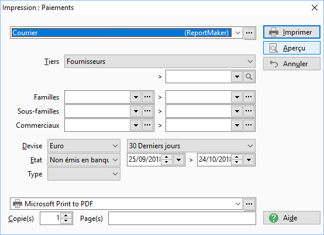
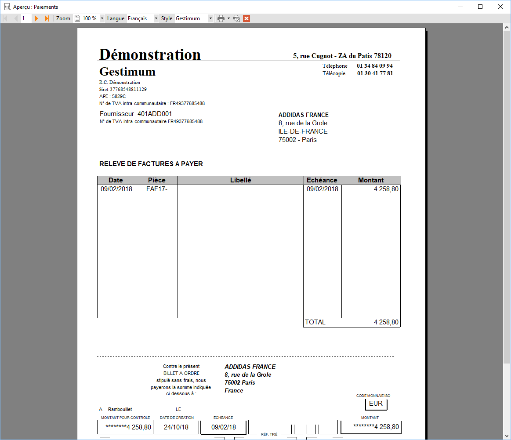
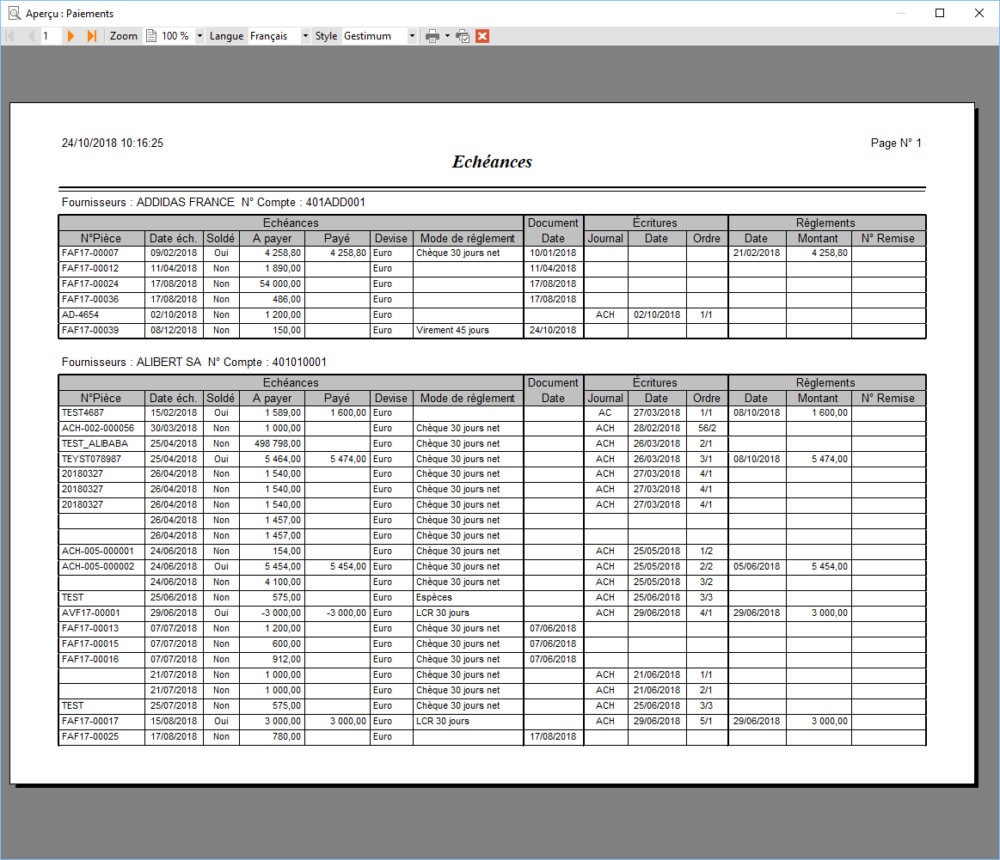
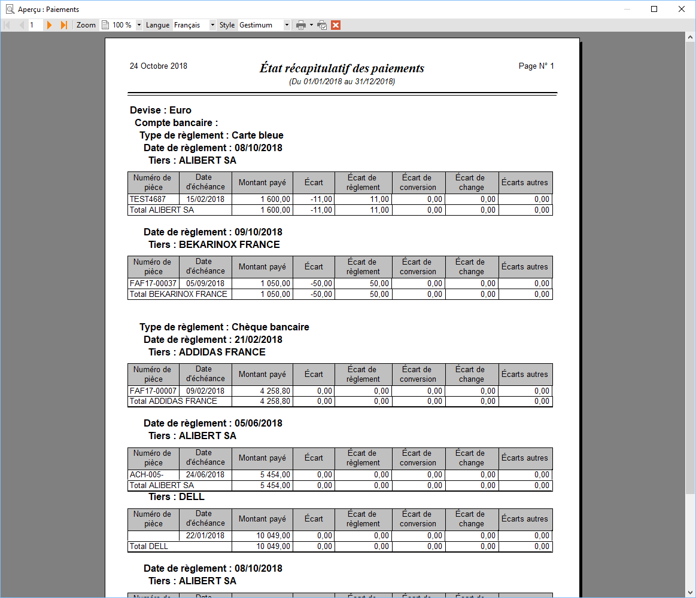
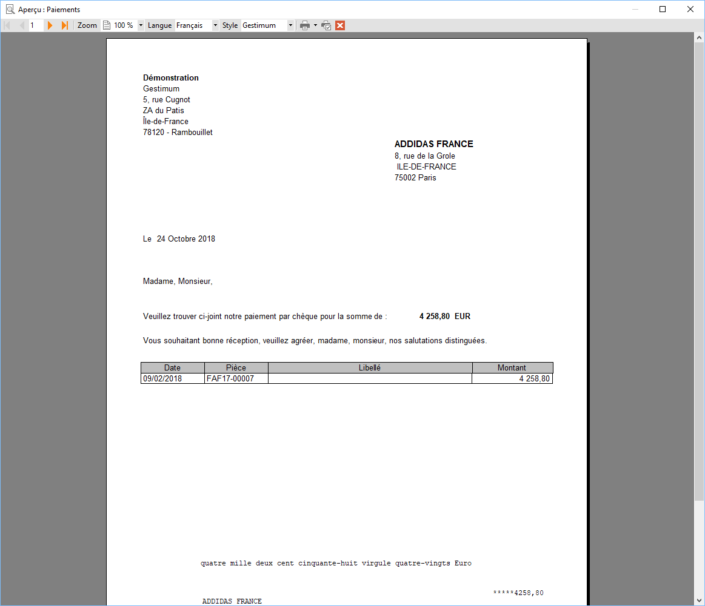
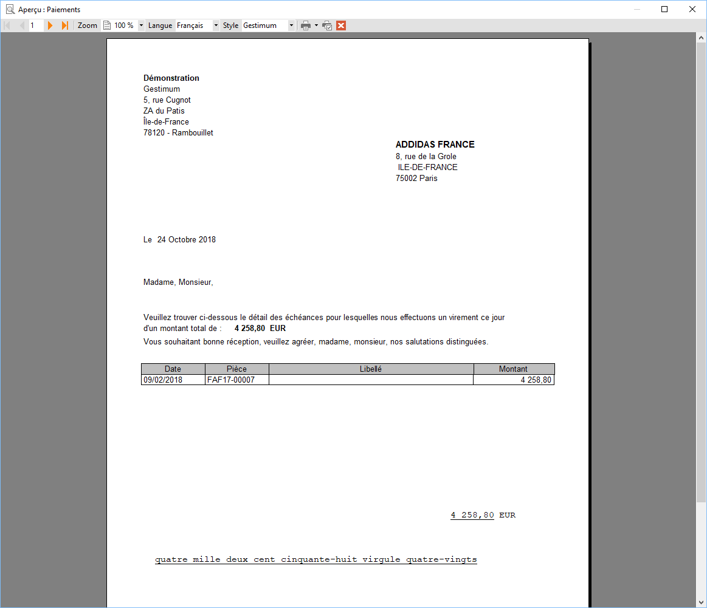
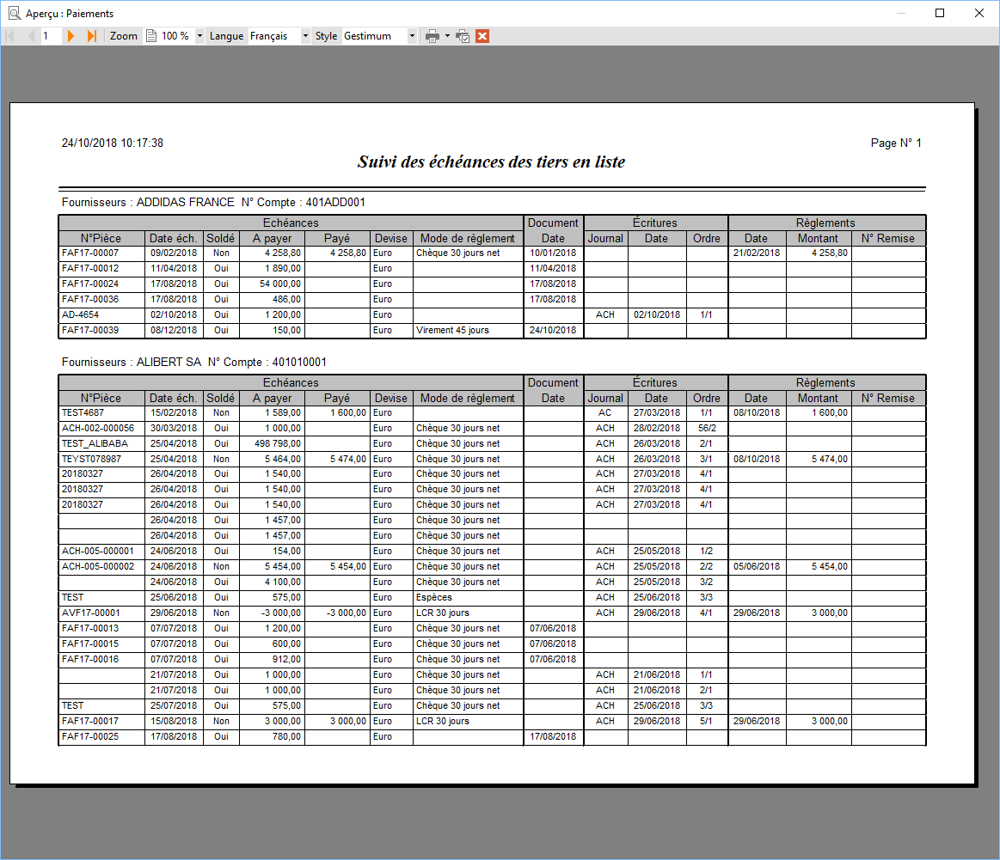

# Impression des paiements préparés
## Options

## Exemples

### Courrier

### Détail paiement avec traite

### Échéances

### État récapitulatif

### Lettre chèque

### Lettre virement

### Liste (par tiers)

### Suivi des échéances des tiers en liste

