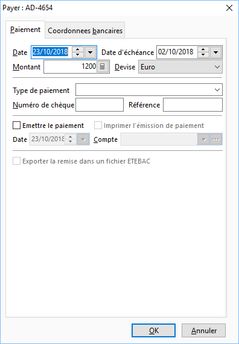

# Paiement

Lorsque vous sélectionnez la commande "Payer l’échéance" à 
 partir de l’échéance courante, cet onglet vous est proposé.

 

## Données de l’échéance

Les données suivante sont reprises automatiquement à partir de l‘échéance 
 courante :

* Date (date d’émission),
* Date d’échéance,
* Montant de l’échéance,
* Devise de l’échéance,
* Type de règlement 
 (si renseigné lors de la création de l’échéance).

 

A part le mode de règlement, il vous possible de modifier ces données 
 puis de saisir les données complémentaires :

* Numéro de chèque,
* Référence de règlement.

## Paiement simple

Pour payer une échéance sans faire d'émission de paiement, vous devez 
 :

* Désélectionner 
 les options "Émettre le paiement" et "Imprimer l'émission 
 de paiement",
* Modifier ou laisser 
 la date de jour,
* Sélectionner le 
 journal dans lequel vous souhaitez effectuer le paiement,
* Cliquer sur OK.

 

Vous retrouverez ce règlement/paiement dans la liste des paiements de 
 la fenêtre "[Préparation des paiements](PreparerPaiements.md)".

## Règlement / paiement et remise

Pour régler/payer une échéance et effectuer automatiquement la remise 
 en banque, vous devez :

* Sélectionner l’option 
 "Émettre le paiement",
* Modifier ou laisser 
 la date du jour,
* Sélectionner le 
 journal dans lequel vous souhaitez effectuer le règlement,
* Cliquer sur OK.

 

Vous retrouverez cette remise/émission dans la liste des remises en 
 banque de la fenêtre "[Émissions 
 de paiements](../Emissions/EmissionsPaiements.md)".

 

Vous pouvez également [imprimer 
 automatiquement l'émission de paiements](../Emissions/Impressions/1/ImpressionEmissionPaiements.md) en sélectionnant l’option 
 "Imprimer l'émission de paiement" avant de faire OK.

## Paiement, remise et fichier ETEBAC

Pour régler/payer une échéance, effectuer automatiquement la remise 
 en banque, et générer le fichier ETEBAC, vous devez obligatoirement :

* Avoir sélectionné 
 un type de règlement particulier (Billet à ordre, LCR, LCR non acceptée, 
 Prélèvement, Virement),
* Sélectionner l’option 
 "Émettre le paiement",
* Avoir renseigné 
 les informations nécessaires à un paiement,
* Sélectionner l’option 
 "Exporter la remise dans un fichier ETEBAC".

 

De plus, il est impératif que 
 les références bancaire du journal de trésorerie soient renseignées ainsi 
 que [le RIB 
 du tiers](PayerListeEcheancesOngletCoordonneesBancaires.md).

 

Suivant le type de mode de règlement, les renseignements à indiquer 
 varient.

 

Pour les Billets à ordre, les LCR et les LCR non acceptées, vous devez 
 indiquer :

* La date de valeur 
 de l’échéance,
* Le code d’entrée.

 

Le code Acceptation est affecté sur le type de règlement par l’intermédiaire 
 du type de remise au niveau des tables de références.

 

Pour les Prélèvements et les Virements, vous devez indiquer :

* La date d’échéance,
* Le code d’opération.

 

Pour valider, cliquez sur Ok, vous aurez alors la fenêtre de demande 
 d’[impression 
 de l'émission de paiement](../Emissions/Impressions/1/ImpressionEmissionPaiements.md), suivie de celle pour enregistrer votre 
 fichier ETEBAC. 

 

Cette deuxième vous propose par défaut le répertoire ‘temp’ 
 de Gestimum, vous pouvez changer de répertoire et saisir un autre nom 
 de fichier…

