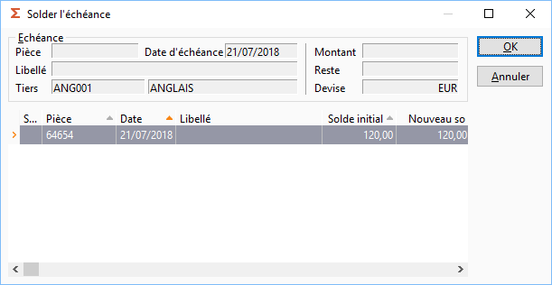

# Solder une échéance avec une autre

Cette fonction est possible à partir du menu contextuel de la liste 
 des échéances à recevoir ou à payer.

 

 

La commande "Solder avec" permet de solder une échéance avec 
 une ou plusieurs échéances dont le montant total est égal ou supérieur 
 à celle-ci.

 

Vous ne pouvez rien saisir dans la fenêtre "solder l’échéance". 
 Elle se décompose de 2 parties : l’échéance à solder et la liste des autres 
 échéances pour ce tiers.

## Entête

Elle affiche le détail de l’échéance que vous souhaitez solder. Les 
 informations suivantes sont à votre disposition :

* Numéro 
 de la pièce,
* Date 
 de l’échéance,
* Libellé/Description 
 de l’échéance,
* Tiers,
* Montant,
* Reste 
 à affecter : Ce champ est automatiquement recalculé en fonction de 
 l’affectation du montant de l’échéance réalisée,
* Devise 
 de l’échéance.

## Liste des échéances

Cette liste affiche les autres échéances du tiers.

## Traitement

A l’ouverture de la fenêtre, un message d’avertissement peut apparaître. 
 Il vous informe que vous ne pouvez solder une échéance lorsque le montant 
 de celle-ci est supérieur au montant total des échéances.

 

La sélection des lignes s’effectue par un simple clic, la barre d’espace 
 ou le menu contextuel + "sélectionner".

 

Ce menu vous permet également d’effectuer les fonctions communes à toutes 
 les grilles.

 

Pour solder l’échéance souhaitée avec une/des échéances de la liste, 
 vous devez sélectionner une ou plusieurs lignes d’échéance de façon à 
 ce que le champ "Reste" 
 de l’entête soit nul (0,00).

 

Il se peut que le montant de l’échéance à solder soit inférieur au montant 
 de l’échéance affectée. Dans ce cas, une nouveau solde sera calculé pour 
 l’échéance affectée.

 

Au fur et à mesure de la sélection des échéances le champ "Reste" est recalculé. Lorsque 
 le champ est nul, l’affectation de l’échéance est terminée. Vous pouvez 
 alors cliquer sur Ok pour valider votre sélection.

 

Un message de confirmation vous informe de l’échéance qui sera soldée 
 et de/des échéances sur lesquelles l’affectation a été effectuée. Il vous 
 est possible d’annuler celle-ci.

 

