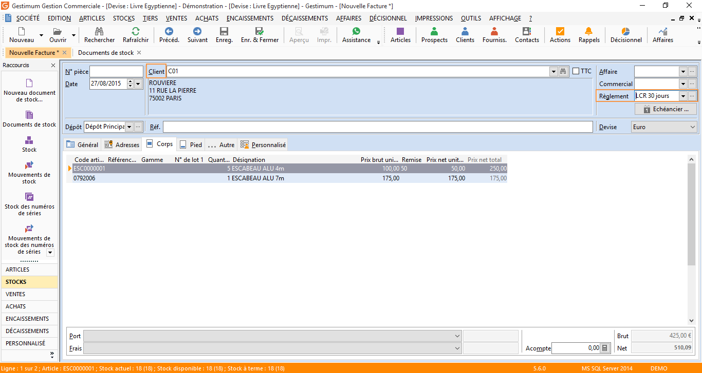
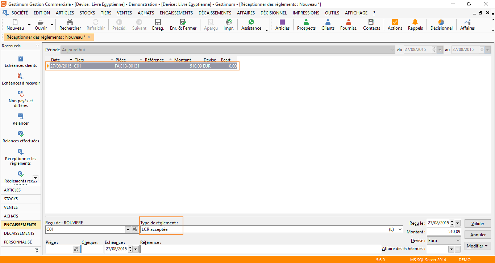
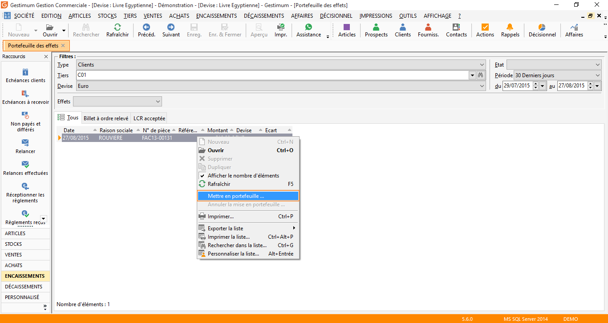
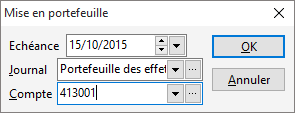
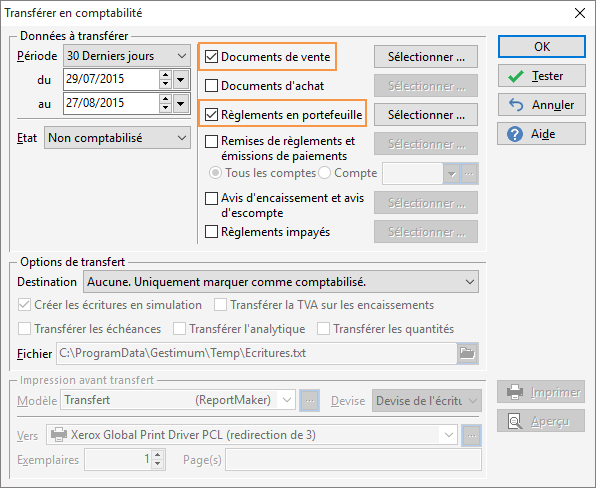
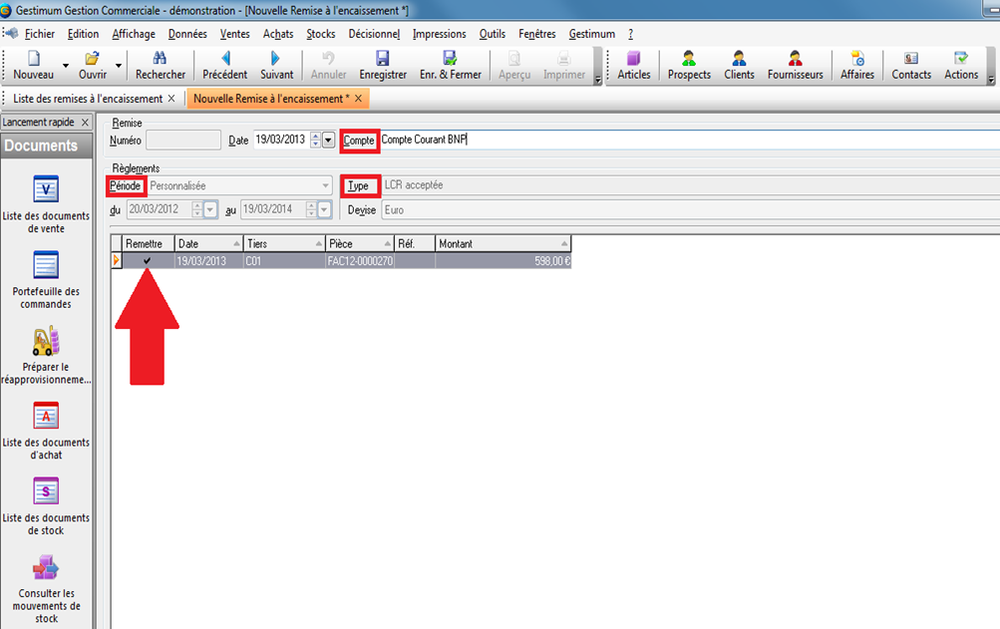

# Effets à recevoir (LCR) de A à Z

Créez la facture client en gestion commerciale puis renseignez le client 
 et le mode de règlement (LCR).

 

 

Faire la réception des règlements avec comme mode de règlement une LCR 
 (Encaissements/Réceptionner des règlements).

 

 

Allez dans Encaissements/Portefeuille des effets, puis faites un clic-droit 
 "Mettre en portefeuille" sur la ligne du règlement.

 

 

Précisez la "date d’échéance", le "journal" et le 
 "compte" avant de valider.

 

 

Faites un transfert comptable (Outils/Transférer dans la comptabilité) 
 de la facture et du règlement en portefeuille.

 

 

En comptabilité cela génère une écriture sur le journal de vente ainsi 
 qu’une écriture 413 débit / 411 crédit dans le journal des effets à recevoir.

 

Allez ensuite dans Encaissements/Remise à l’encaissement puis en faire 
 une nouvelle (même fonctionnement qu’une remise en banque, clic droit 
 "nouveau")

 

Sélectionnez le "compte" et votre"période" ainsi 
 que le "Type", cliquez sur "remettre" et enfin Enregistrez

Cela génère une écriture 413 crédit / 512 débit sur le journal de banque.

 

On peut alors lettrer notre compte 411et notre compte 413

