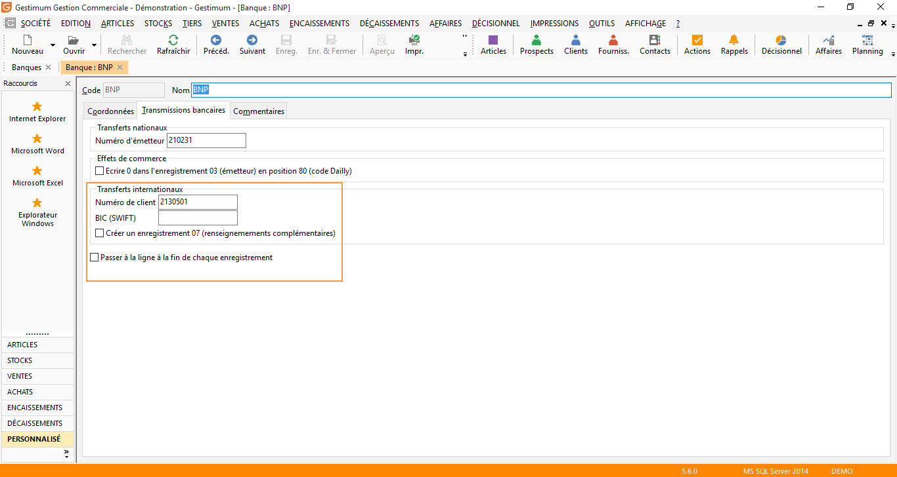
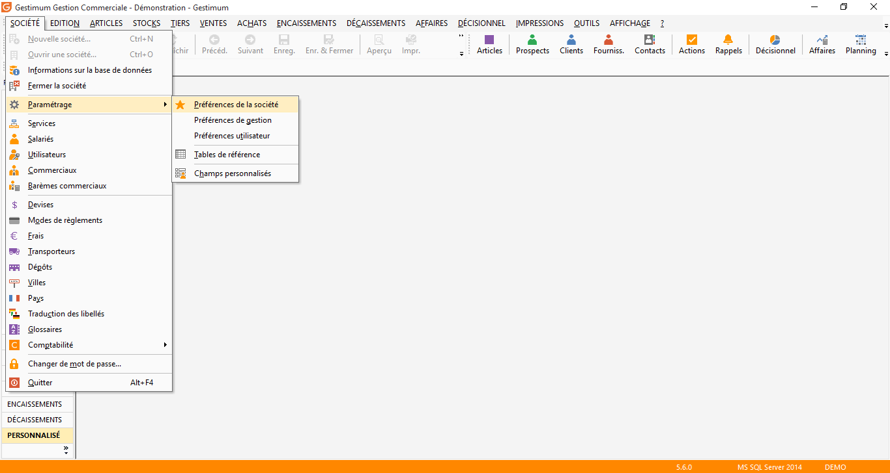
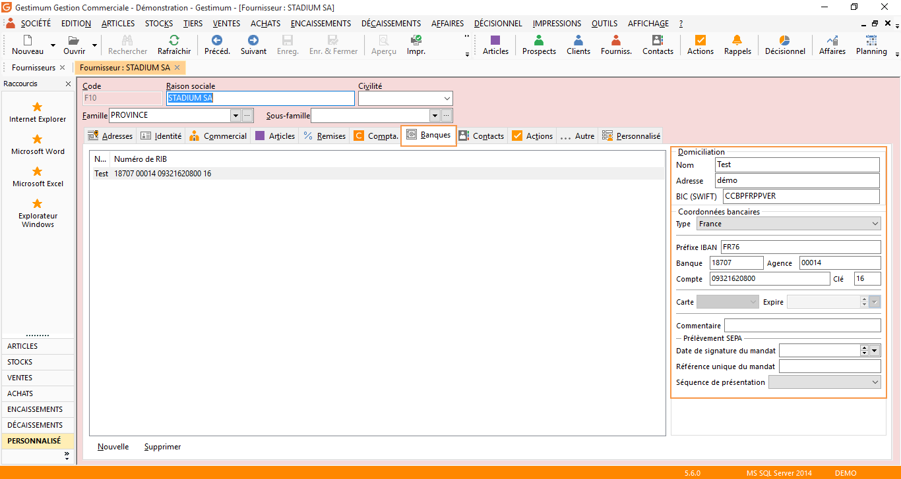
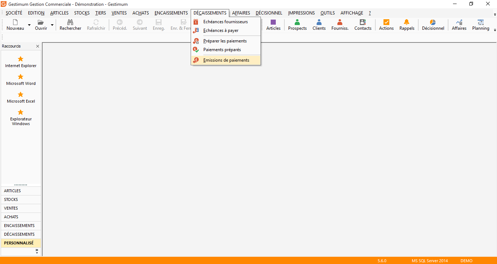
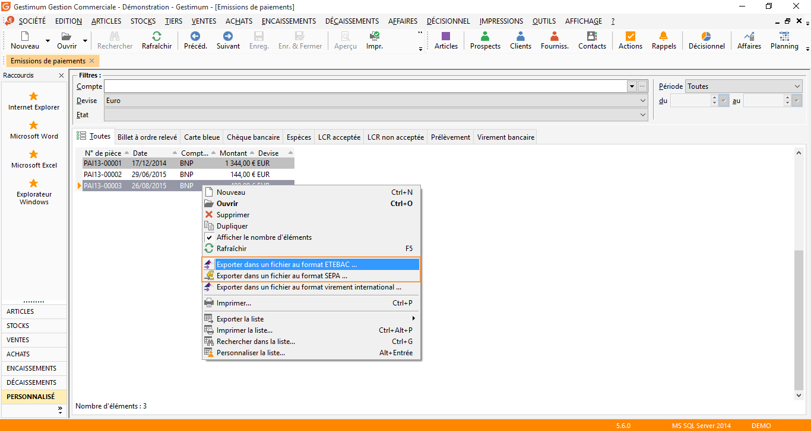
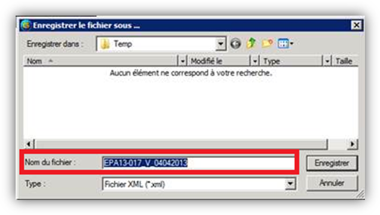

# Fichiers bancaires de virements aux formats SEPA et ETEBAC

Pour faciliter "les transactions bancaires" avec vos interlocuteurs, 
 Gestimum ERP a développé la génération des fichiers de virements SEPA 
 et ETEBAC.

 

Pour les remises de type LCR ou Prélèvements, une fois la remise enregistrée, 
 vous pouvez générer un fichier XML au format SEPA à partir du menu contextuel 
 (clic droit sur l’entête de la remise en banque) + Remise magnétique.

### Paramétrages

Renseignez le "numéro de client" fourni 
 par votre organisme bancaire dans la sous partie Transferts internationaux 
 de l’onglet "Transmission bancaire" de la fiche banque (Société/Comptabilités/Comptes 
 bancaires).

 

 

L’option "Passer à la ligne" à la 
 fin de chaque enregistrement doit être cochée si le fichier à générer 
 doit avoir une longueur limitée par enregistrement.

 

Ensuite allez dans "Société/Paramétrage/Préférences 
 de la société"

 

 

Allez dans l’onglet "Encaissement" 
 puis renseignez "l’identifiant créancier SEPA"

 

Il faut également paramétrer l’onglet "Banque" 
 la fiche fournisseur via le menu "Tiers/Fournisseurs"

 

## Génération du fichier SEPA ou ETEBAC

Pour pouvoir générer votre fichier SEPA ou ETEBAC, 
 vous devez préalablement avoir généré le règlement de cet effet.

 

Générez votre Émission de paiement par le menu 
 "Décaissement/Émission de paiements", la remise doit être de 
 type "Virement bancaire".

 

 

Depuis la fonctionnalité "Décaissement/Émission 
 des paiements" via le clic droit "Exporter dans un fichier SEPA" 
 ou "Exporter dans un fichier ETEBAC" le fichier pourra être 
 généré

 

 

Sélectionnez votre format puis "Enregistrez" 
 votre fichier

 

Le fichier ainsi généré pourra être envoyé à 
 la banque.

