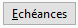

# Echéances à relancer

Une fois les tiers à relancer sélectionnés, vous pouvez affiner votre 
 sélection en sélectionnant une à une les échéances à traiter.

 

Par le menu contextuel, ou le Bouton , 
 vous avez la possibilité de :

* Choisir les échéances 
 à relancer,
* Modifier la date 
 d'une échéance (voir ci-dessous).

## Choix des échéances à relancer

Par défaut les échéances correspondantes aux critères choisis en entête 
 de la génération des relances sont sélectionnées.

 

Pour chaque échéance, il est affiché par défaut dans la grille les informations 
 suivantes :

* Sélection de l’échéance 
 à relancer
* Date de l'échéance
* Numéro de pièce
* Libellé de l’échéance
* Solde de la relance 
 dans la devise du tiers
* Solde de l’échéance 
 dans la devise locale
* Solde de l’échéance 
 dans la devise du dossier
* Solde de l’échéance 
 dans la devise du tiers
* Devise du tiers
* Nombre de relances 
 effectuées sur l’échéances : Ce nombre est incrémenté lors de la validation 
 du Traitement de relance. Il permet de filtrer les échéances à relancer 
 dans l’entête de la génération des relances

 

Pour afficher les autres champs, vous devez sélectionner l’option propriétés 
 de la grille par le menu contextuel.

 

Le choix des échéances à relancer s’effectue par un simple clic ou le 
 menu contextuel puis :

* Sélectionner ou 
 Désélectionner : sélection/désélection des lignes d’échéance une à 
 une,
* Sélectionner Tout: 
 sélection de toutes les lignes d’échéance,
* Inverser la sélection: 
 sélection inverse de ce qui à été réalisé auparavant.

 

Comme toutes les autres listes, le menu contextuel vous donne accès 
 aux fonctions générales d'une grille.

