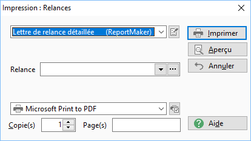

# Impression des relances

L’impression des lettres de relances peut s’effectuer à partir des modèles 
 ReportMaker (situés dans le répertoire Modèles).

 

Cette boite d’impression a un comportement commun à toutes les autres.

 

Les modèles proposés tiennent compte du niveau de relance sélectionné 
 dans la [fenêtre 
 précédente](../../../Relances/RelancesAZ/RelancesAZ.md).

 

Les modèles fournis par Gestimum ont une extension .Relance.rpm, vous 
 pouvez les modifier ou créer vos propres documents, ils seront proposés 
 lors de l'impression si l'extension du fichier correspond.

 

Le numéro de relance est renseigné suivant le 
 paramétrage du compteur des relances (menu Société/Paramétrage/Préférences 
 de la société - Onglet Compteur - Autres).

 

