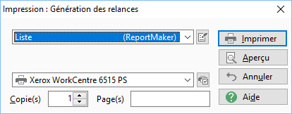
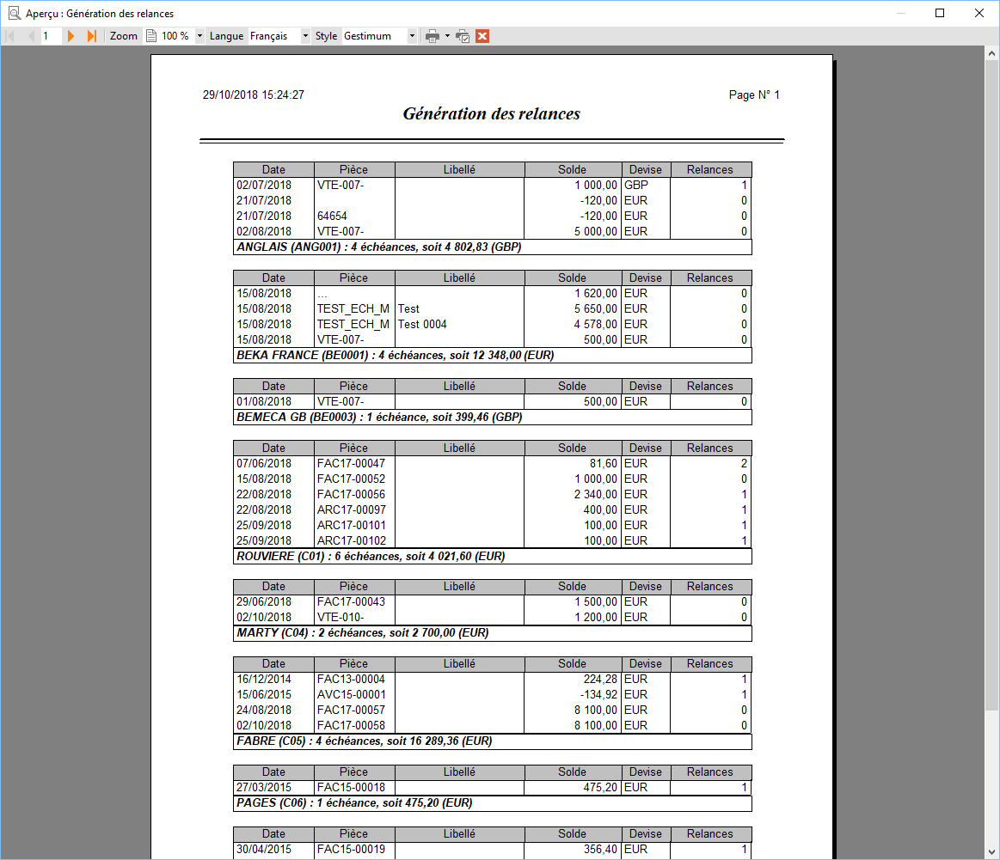
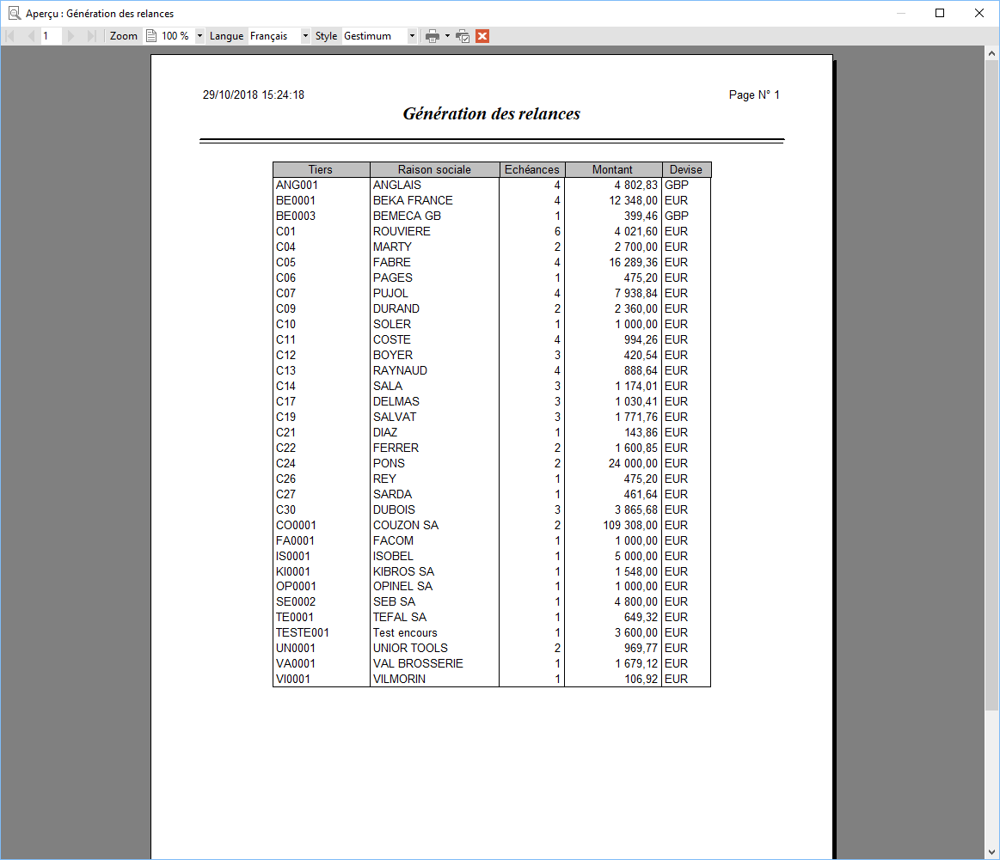

# Impression de la sélection des tiers à relancer

L’impression de la sélection des tiers à relancer peut s’effectuer à 
 partir du menu contextuel de la grille de la génération des relances.

 

Les modèles proposés sont des modèles ReportMaker (situés dans le répertoire 
 Modèles).

 

Cette boite d’impression 
 a un comportement commun à toutes les autres.

 

 

Liste détaillée.GenerationRelances.rpm

Liste.GenerationRelances.rpm

