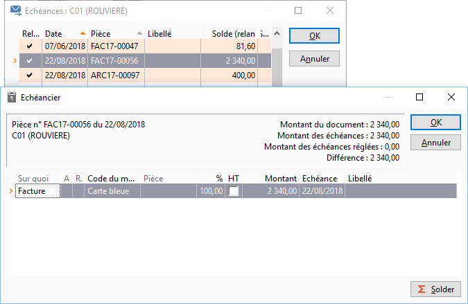

# Modifier une échéance à relancer
Les échéances à relancer pour un tiers sont consultables et modifiables 
 (date d’échéance) par le bouton Échéances, un double-clic sur la ligne 
 du tiers ou par le menu contextuel Échéances.

 

Le bouton Modifier permet alors de changer la date d’échéance pour la 
 repousser si nécessaire, soit pour une date précise, soit par report en 
 nombre de jours.

 

