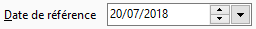
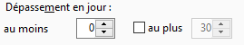

# Nombre de jours de dépassement

L'exemple suivant va illustrer le calcul fait par Gestimum pour afficher 
 un certain nombre d'échéances en fonction d'un nombre de jours de dépassement 
 paramétrés :

 

 

Voici la liste des échéances affectées à un 
 tiers, le nombre de jours de dépassement ont été calculés par rapport 
 à la date de référence le 20/07/18.

  

| Date d'échéance | Date de référence | Nombre de jours de dépassements |
|   | 20/07/2018 |   |
| 01/01/2018 |   | 200 |
| 18/06/2018 |   | 32 |
| 18/07/2018 |   | 2 |
| 19/07/2018 |   | 1 |
| 20/07/2018 |   | 0 |
| 21/07/2018 |   | -1 |
| 31/08/2018 |   | -42 |

 

Si l'utilisateur paramètre le nombre de jours 
 "Au moins" et "Au plus" comme décrit dans le tableau 
 ci-dessous, les échéances affichées seront les suivantes, cas par cas 
 :

  

| Au moins | Coche | Au plus | Échéances | Nombre jours |
| 0 | x | 0 | 20/07/2018 | 0 |
|   |
| 0 |   |   | 01/01/2018 | 200 |
|   |   |   | 18/06/2018 | 32 |
|   |   |   | 18/07/2018 | 2 |
|   |   |   | 19/07/2108 | 1 |
|   |   |   | 20/07/2018 | 0 |
|   |   |   | 21/07/2018 | -1 |
|   |   |   | 31/08/2018 | -42 |
|   |
| 1 |   |   | 01/01/2018 | 200 |
|   |   |   | 18/06/2018 | 32 |
|   |   |   | 18/07/2018 | 2 |
|   |   |   | 19/07/2018 | 1 |
|   |
| 1 | x | 1 | 19/07/2018 | 1 |
|   |   |   |   |   |
| 0 | x | 1 | 19/07/2018 | 1 |
|   |   |   | 20/07/2018 | 0 |
|   |   |   |   |   |
| -1 | x | -1 | 21/07/2018 | -1 |
|   |
| -1 |   |   | 01/01/2018 | 200 |
|   |   |   | 18/06/2018 | 32 |
|   |   |   | 18/07/2018 | 2 |
|   |   |   | 19/07/2018 | 1 |
|   |   |   | 20/07/2018 | 0 |
|   |   |   | 21/07/2018 | -1 |

  

