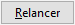
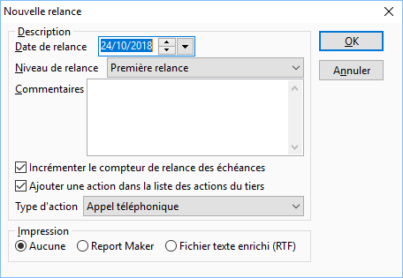

# Nouvelle relance

Une fois les tiers et les échéances par tiers ayant été sélectionnés, 
 la génération de la relance est possible par le bouton .

## Description de la relance

Dans cette partie vous devez déterminer le paramétrage de la/les lettres 
 de relance que vous allez générer.

 

La date de relance est la date système par défaut.

 

Le niveau de relance détermine l’édition des lettres de relance. Vous 
 disposez de 4 niveaux : Relance avant échéance / Première relance / Deuxième 
 relance et Troisième relance.

 

Vous pouvez saisir un commentaire qui sera reporter automatiquement 
 sur la fiche de la relance réalisée. Vous pouvez consulter cette relance 
 dans l’[historique 
 des relances](../Relances/RelancesEffectuees/RelancesEffectuees.md) (menu Encaissements/Relances effectuées).

 

Deux options facultative peuvent être sélectionnées :

* Incrémenter le compteur de 
 relance des échéances

Cette option permet d’augmenter de 1 le nombre 
 de relances réalisées pour l’échéance. Vous pouvez voir ce compteur à 
 partir de la [liste des échéances](EcheancesRelancer.md) d’un 
 tiers appelée depuis la [génération des relances](Relancer.md).

* Ajouter une entrée dans la 
 liste des actions du tiers

* Cette option est disponible 
 uniquement en gestion commerciale. Elle permet de créer automatiquement 
 une action dans la fiche du tiers (dans Gestimum gestion commerciale). 
 Cette action contiendra la date, l’heure, le numéro de la relance 
 réalisée et le commentaire de la relance

## Impression des relances

Vous pouvez choisir d’incrémenter vos relances sans aucune édition.

 

L’impression des lettres de relances peut s’effectuer à partir :

* Des modèles Report Maker (situés 
 dans le répertoire Modèles des Préférences de l'utilisateur),
* Des documents RTF (situés 
 dans le sous répertoire "Relances" du répertoire Documents 
 des Préférences de l'utilisateur).

## Validation des relances

Suite à la validation de la fenêtre par le bouton OK, les relances seront 
 créées suivant l’option d’impression choisie :

* Création uniquement de la 
 relance sans édition,
* Création et impression de 
 la relance après sélection du modèle Report Maker,
* Création et impression de 
 la relance après sélection du modèle RTF.

