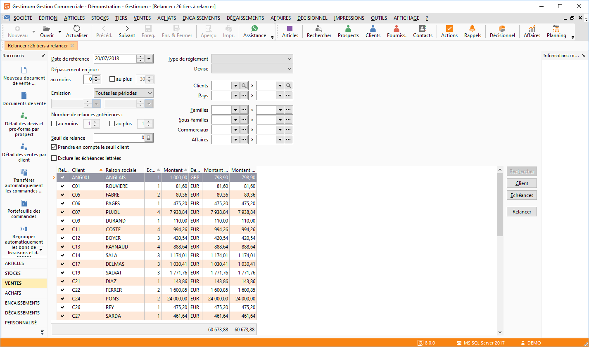

# Relancer

La gestion des relances (menu Encaissements/Relances) permet d’obtenir, 
 pour une population souhaitée, les tiers qui sont à relancer en tenant 
 compte de la date de référence, du nombre de jours de dépassement, du 
 nombre de relances antérieures et du seuil de relance.

 

## Entête

### Paramétrage des échéances à relancer

#### La date de référence et dépassement

Le logiciel prendra en compte uniquement les échéances des tiers dont 
 la date d'échéance est antérieure ou égale à la date de référence (si 
 elle est dépassée).

#### Nombre de jours de dépassement

Cette option permet de calculer le nombre de jours pour lesquels l’échéance 
 est dépassée par rapport à la date de référence (Date de référence - Date 
 d'échéance).

 

Cette option permet de sélectionner les échéances du tiers suivant un 
 nombre minimum et/ou maximum de jours de dépassement.

Au Moins : Cette zone permet 
 d'afficher seulement les échéances dépassées d'au moins X jours par rapport 
 à la date de référence. Les valeurs acceptés sont zéro, + X et - X.

Au plus : Cette zone permet 
 d'afficher seulement les échéances dépassées d'au plus Y jours par rapport 
 à la date de référence. Les valeurs acceptés sont zéro, + X et - X.

Lorsque les deux options sont associées, les échéances affichées seront 
 comprises entre au moins X jours et au plus Y jours.

 

Relances préventives : La saisie 
 d'un nombre de jours négatifs permet a réalisation des relances préventives 
 pour un meilleur contrôle de qualité de facturation

 

Exemple : "[Exemple 
 Relance Nombre de jours de dépassement](NombreJoursDepassement.md)".

#### Nombre de relances antérieures

Le nombre de relances est incrémenté à chaque 
 traitement de relance pour chaque échéance traitée. Vous pouvez visualiser 
 celui-ci dans la [fenêtre 
 de détail des échéances d'un tiers](EcheancesRelancer.md).

 

Le logiciel prendra en compte uniquement les échéances ayant un nombre 
 de relances d’Au moins X et/ou Au plus Y relances déjà effectuées

### Seuil de relance

Le seuil de relance permet de limiter les relances aux tiers dont le 
 total des échéances à relancer est supérieur au seuil de relance. Le seuil 
 peut être un seuil commun à tous les tiers, ou le seuil indiqué dans la 
 fiche du tiers ou la fiche compte (option : Prendre en compte le seuil 
 client).

 

Prendre en compte le seuil client est prioritaire sur le seuil de relance.

 

Remarque : si le seuil de la 
 fiche client est à 0, c’est celui de la fenêtre de relance qui est pris 
 en compte. Exclure les échéances lettrées cette option permet de d'exclure 
 les échéances déjà lettrées paramétrage des tiers à relancer la gestion 
 des relances s’applique par défaut à la totalité de vos tiers mais peut 
 être limitée :

* Au tiers ayant 
 un type de règlement spécifique,
* Au tiers ayant 
 une devise précise,
* à Une fourchette 
 de tiers,
* à Une fourchette 
 de pays Lors de la génération des relances en gestion commerciale, 
 vous avez également la possibilité de limiter les tiers à relancer 
 en sélectionnant:·une fourchette de familles de tiers,
* Une fourchette 
 de sous-familles de tiers,
* Une fourchette 
 de représentants.

### Liste des tiers à relancer

La liste des tiers à relancer répond aux critères définis en entête 
 de la fenêtre de relance.

 

Pour chaque tiers, vous pouvez afficher dans la grille, par le menu 
 contextuel propriétés de la grille, les informations suivantes :

* La colonne de sélection 
 du tiers à Relancer,
* Le code client 
 et la raison sociale du tiers (en gestion commerciale) et N° de compte 
 et Libellé de compte (en comptabilité),
* Le nombre total 
 d’échéances à relancer "en cours" déterminé en fonction 
 des filtres,
* Le montant total 
 des échéances dans la devise du tiers , la devise locale, la devise 
 Euro,
* La devise du client,
* Le seuil de relance 
 de la fiche client ou la fiche compte.

#### Sélection de tiers à relancer

A l’ouverture de la liste des tiers à relancer, toutes les lignes sont 
 sélectionnées par défaut colonne "Relancer".

 

Pour modifier cette sélection, il vous suffit de faire un double clic 
 dans la colonne Sélectionnée (TMP\_SELECT). Le menu contextuel vous permet 
 également de sélectionner plus rapidement les lignes de client à relancer: 
 Désélectionner, Sélectionner tout, Inverser la sélection.

 

Si vous réalisez une modification au niveau des paramètres de l’entête, 
 vous devez cliquer sur le bouton Rechercher ou faire F5 afin de mettre 
 à jour votre liste des tiers à relancer.

 

Le choix des tiers à relancer s’effectue par le double clic ou par le 
 menu contextuel, différentes options sont disponibles :

* Sélectionner ou 
 Désélectionner : sélection/désélection des lignes d’échéance une à 
 une,
* Sélectionner Tout 
 : sélection de toutes les lignes d’échéance,
* Inverser la sélection 
 : sélection inverse de ce qui à été réalisé auparavant

* "Fiche client" 
 ou Bouton : vous permet de voir la Fiche Client ou fiche compte, vous 
 pouvez ainsi consulter son seuil de

 

Relance voir même le modifier, il sera automatiquement pris en compte 
 lorsque vous.

 

Retournerez sur la liste des clients à relancer

* Échéances ou Bouton 
 : Les échéances à relancer d’un tiers peuvent être consultées et/ou 
 modifiées à partir de la liste des échéances. Cette liste est accessible 
 à partir du bouton Échéances , suite à un double clic sur la ligne 
 du tiers ou par le menu contextuel + Échéances
* Relancer ou Bouton 
 : Voir ci-dessous, traitement des relances

* Imprimer la sélection 
 : Impression de la sélection des tiers à relancer

 

L’impression de la sélection des tiers à relancer peut s’effectuer à 
 partir du menu contextuel de la grille de la génération des relances.

 

Les modèles proposés sont des modèles ReportMaker (situés dans le répertoire 
 Modèles) avec une extension .GenerationRelances.rpm.

 

Cette boite d’impression 
 a un comportement commun à toutes les autres.

 

Comme toutes les autres listes, le menu contextuel vous donne accès 
 aux fonctions générales d’une grille.

## Traitement des relances

Une fois la sélection des lignes de tiers à relancer effectuée, cliquez sur le "Bouton 
 Relancer" ou menu contextuel + Relancer pour lancer [le traitement](NouvelleRelance.md).

