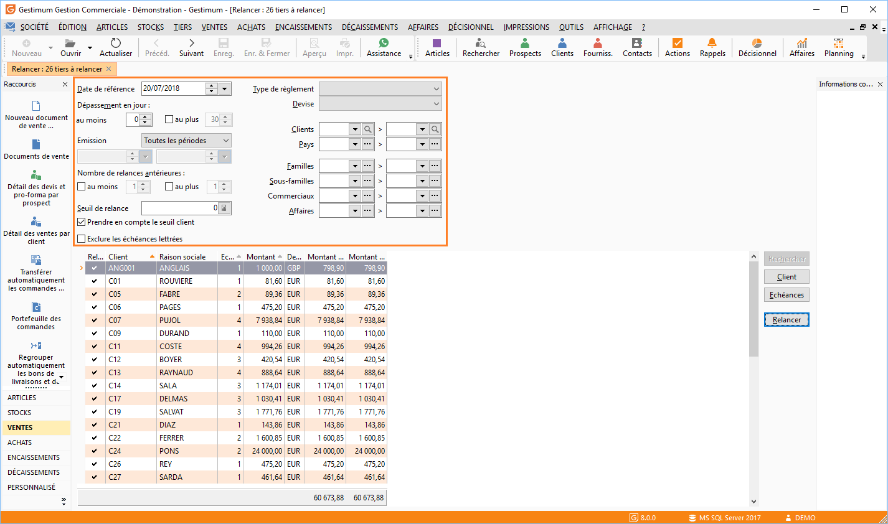
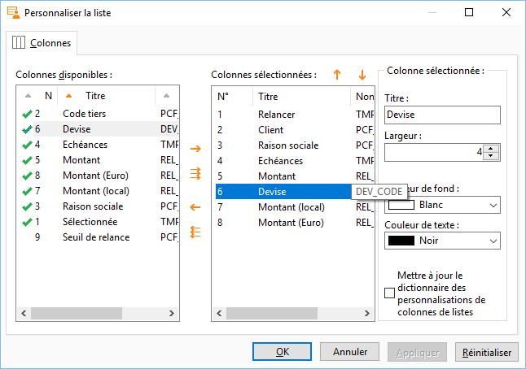
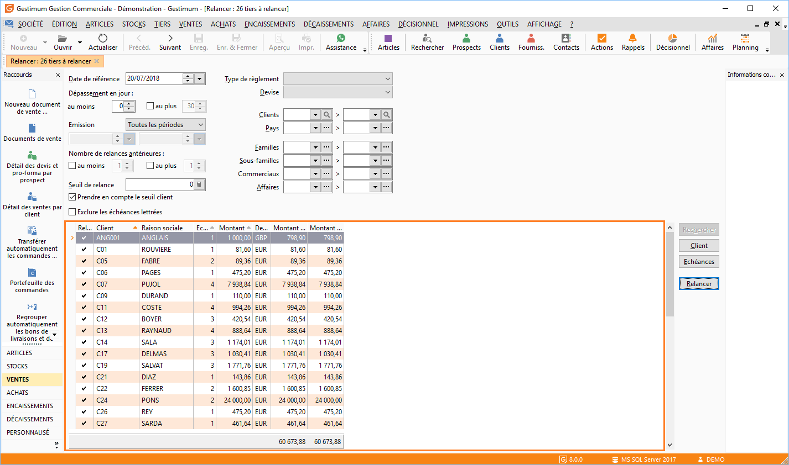
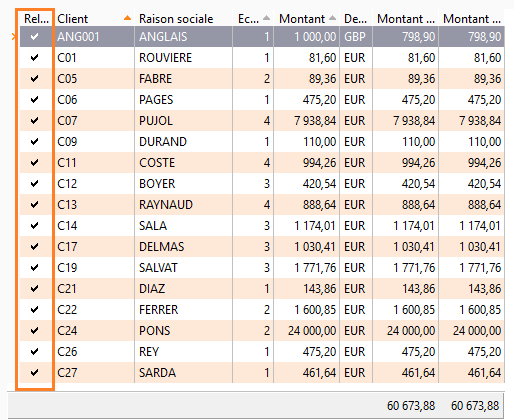
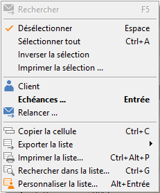
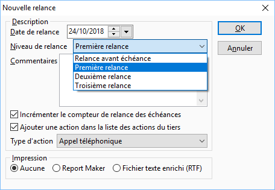
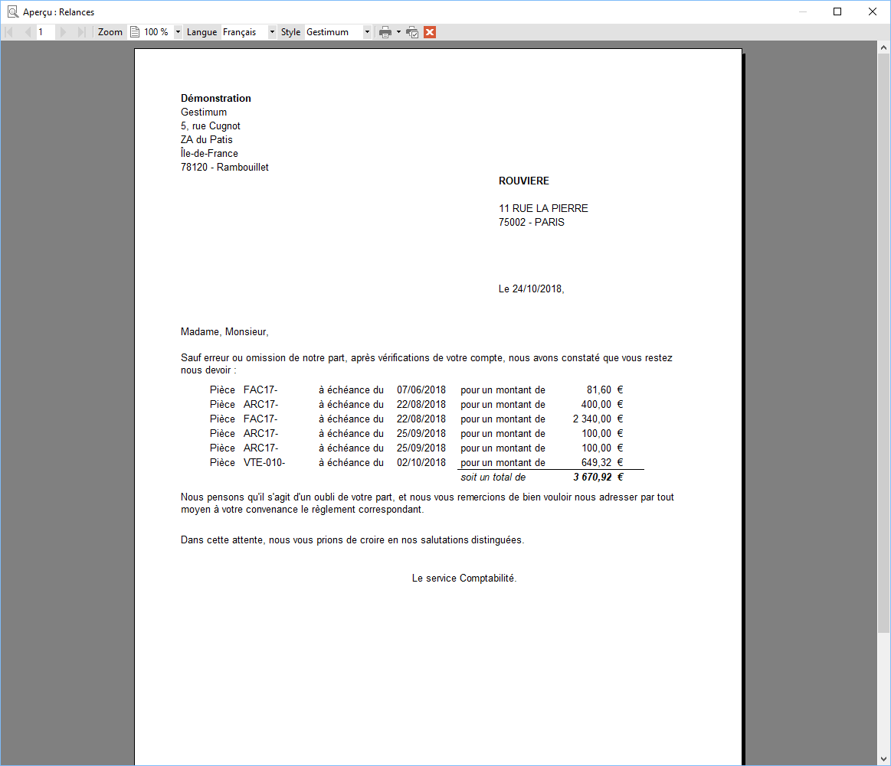
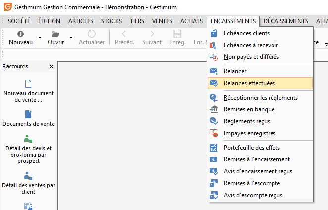
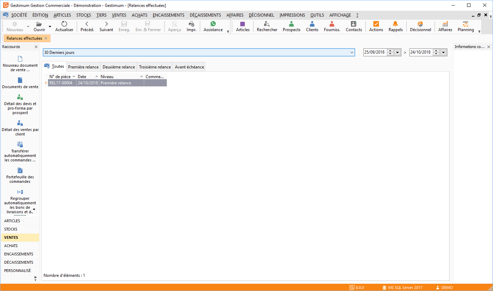

# Relances de A à Z

La gestion des relances, menu Encaissements/Relancer", permet d’obtenir, 
 pour une population souhaitée, les tiers qui sont à relancer en tenant 
 compte de la date de référence, du nombre de jours de dépassement, du 
 nombre de relances antérieures et du seuil de relance.

## Le paramétrage

### La date de référence et dépassement

Le logiciel prendra en compte uniquement les échéances des tiers dont 
 la date d'échéance est antérieure ou égale à la date de référence (si 
 elle est dépassée).

### Nombre de jours de dépassement

Cette option permet de calculer le nombre de jours pour lesquels l’échéance 
 est dépassée par rapport à la date de référence (Date de référence - Date 
 d'échéance).

 

Cette option permet de sélectionner les échéances du tiers suivant un 
 nombre minimum et/ou maximum de jours de dépassement.

 

Au Moins 
 : Cette zone permet d'afficher seulement les échéances dépassées d'au 
 moins X jours par rapport à la date de référence. Les valeurs acceptées 
 sont zéro, + X et X.

Au plus : 
 Cette zone permet d'afficher seulement les échéances dépassées d'au plus 
 Y jours par rapport à la date de référence. Les valeurs acceptées sont 
 zéro, + X et X.

Lorsque les deux options sont associées, les échéances affichées seront 
 comprises entre au moins X jours et au plus Y jours.

 

Relances préventives : La saisie 
 d'un nombre de jours négatifs permet la réalisation des relances préventives 
 pour un meilleur contrôle de qualité de facturation

### Nombre de relances antérieures

Le nombre de relances est incrémenté à chaque traitement de relance 
 pour chaque échéance traitée. Vous pouvez visualiser celui-ci dans la 
 [fenêtre 
 de détail des échéances d'un tiers](mk:@MSITStore:C:/Program Files/Gestimum/4.8.0 build 571/GestimumGestion.chm::/Références/Ech_ances___relancer.md).

 

Le logiciel prendra en compte uniquement les échéances ayant un nombre 
 de relances d’Au moins X et/ou Au plus Y relances déjà effectuées.

### Seuil de relance

Le seuil de relance permet de limiter les relances aux tiers dont le 
 total des échéances à relancer est supérieur au seuil de relance. Le seuil 
 peut être un seuil commun à tous les tiers, ou le seuil indiqué dans la 
 fiche du tiers ou la [fiche 
 compte](mk:@MSITStore:C:/Program Files/Gestimum/4.8.0 build 571/GestimumGestion.chm::/Références/Plan_comptable___Onglet_Tiers.md). (Option 
 : Prendre en compte le seuil client).

### Prendre en compte le seuil client

Est prioritaire sur le seuil de relance. Remarque 
 : Si le seuil de la fiche client est à 0, c’est celui de la fenêtre de 
 relance qui est pris en compte.

### Exclure les échéances lettrées

Cette option permet d'exclure les échéances déjà lettrées.

### Filtres

La gestion des relances s’applique par défaut à la totalité de vos tiers 
 mais peut être limitée :

* Au tiers ayant 
 un type de règlement spécifique,
* Au tiers ayant 
 une devise précise,
* à Une fourchette 
 de clients,
* à Une fourchette 
 de pays.

 

Lors de la génération des relances en gestion commerciale, vous avez 
 également la possibilité de limiter les tiers à relancer en sélectionnant 
 :

* Une fourchette 
 de Familles de tiers,
* Une fourchette 
 de Sous-familles de tiers,
* Une fourchette 
 de commerciaux,
* Une fourchette 
 de code affaire.

 

Une fois vos critères choisis cliquez sur recherchez à droite

## Les tiers à relancer

La liste des tiers à relancer répond aux critères définis en entête 
 de la fenêtre de relance.

 

Pour chaque tiers, vous pouvez afficher dans la grille, par le menu 
 contextuel (clic droit) [personnaliser 
 la liste](mk:@MSITStore:C:/Program Files/Gestimum/4.8.0 build 571/GestimumGestion.chm::/Références/Propri_t_s___param_trage_des_colonnes.md), les informations suivantes :

* La colonne de sélection 
 du tiers à relancer,
* Le code client 
 et la raison sociale du tiers (en gestion commerciale) et N° de compte 
 et Libellé de compte (en comptabilité),
* Le nombre total 
 d’échéances à relancer "en cours" déterminé en fonction 
 des filtres,
* Le montant total 
 des échéances dans la devise du tiers, la devise locale, la devise 
 Euro,
* La devise du client,
* Le seuil de relance 
 de la fiche client ou la fiche compte.

## Sélection de tiers à relancer

A l’ouverture de la liste des tiers à relancer, 
 toutes les lignes sont sélectionnées par défaut colonne "Relancer".

 

Pour modifier cette sélection, il vous suffit 
 de faire un double clic dans la colonne "Relancer" (TMP\_SELECT).

 

Le menu contextuel (clic droit) vous permet 
 également de sélectionner plus rapidement les lignes de client à relancer 
 : Désélectionner, Sélectionner tout, Inverser la sélection

 

Le choix des tiers à relancer s’effectue par 
 le double clic ou par le menu contextuel (clic droit), différentes options 
 sont disponibles :

* Sélectionner ou 
 Désélectionner : sélection/désélection des lignes d’échéance une à 
 une,
* Sélectionner Tout 
 : sélection de toutes les lignes d’échéance,
* Inverser la sélection 
 : sélection inverse de ce qui a été réalisé auparavant,
* Imprimer la sélection 
 : Impression de la sélection des tiers à relancer,

* "Client" 
 : vous permet de voir la Fiche Client ou fiche compte, vous pouvez 
 ainsi consulter son seuil de relance voir même le modifier, il sera 
 automatiquement pris en compte lorsque vous retournerez sur la liste 
 des clients à relancer,
* Échéances : Les 
 échéances à relancer d’un tiers peuvent être consultées et/ou modifiées 
 à partir de la liste des échéances. Cette liste est accessible à partir 
 du bouton Échéances, suite à un double-clic sur la ligne du tiers 
 ou par le menu contextuel + Échéances,
* Relancer : Voir 
 ci-dessous, traitement des relances.

 

Si vous réalisez une modification au niveau 
 des paramètres de l’entête, vous devez cliquer sur le bouton "Rechercher" 
 ou faire"F5" afin de mettre à jour votre liste des tiers à relancer.

## Traitements des relances

Une fois la sélection des lignes de tiers à 
 relancer effectuée, cliquez sur le "Bouton Relancer".

 

La fenêtre suivante vous permet de choisir la 
 date de relance ainsi que le niveau de relance. Vous pouvez également 
 "Incrémenter le compteur de relances" mais aussi créer une "action" 
 (voir la fiche thématique action pour l’utilisation).

 

Une fois le niveau de relance choisi cliquez 
 sur "OK" puis enregistrez votre fichier. Visualisation d’une 
 lettre de relance

## Historique des relances

Allez dans le menu "Encaissements/Relances 
 effectuées".

 

Cette liste affiche les relances effectuées 
 pour une période définie. Les relances sont présentées par onglet de Niveau 
 de relance.

 

Dans l’entête de l’historique, vous avez la 
 possibilité de sélectionner une période précise de consultation des relances 
 effectuées. Cette sélection peut s’effectuer par la liste déroulante du 
 champ période ou par la saisie directe d’une date ou fourchette de dates.

