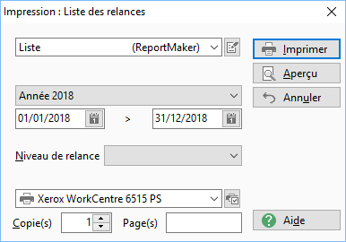
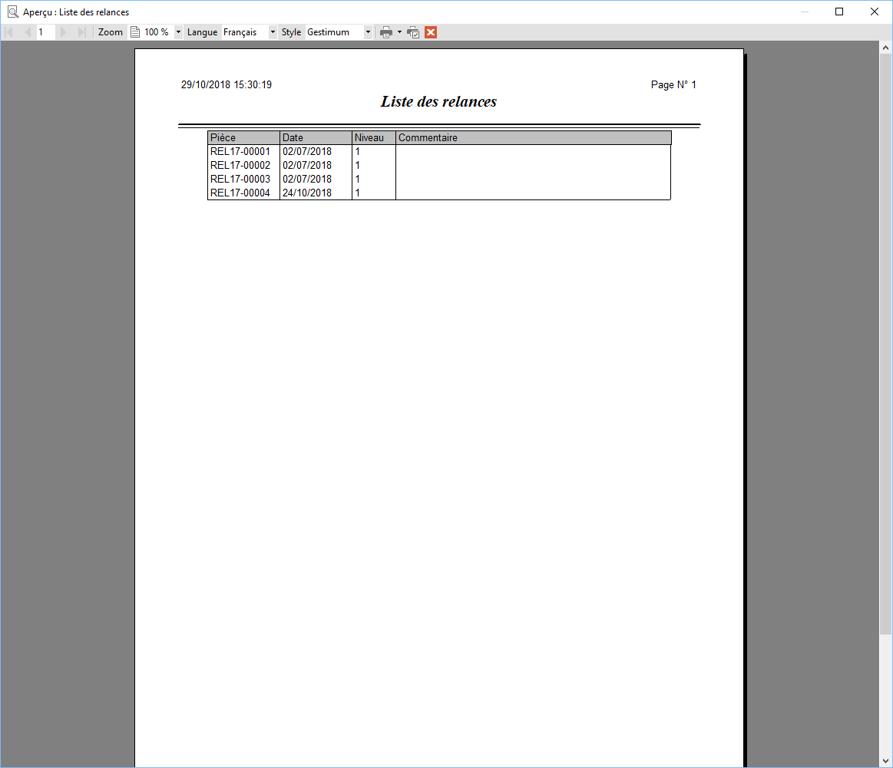
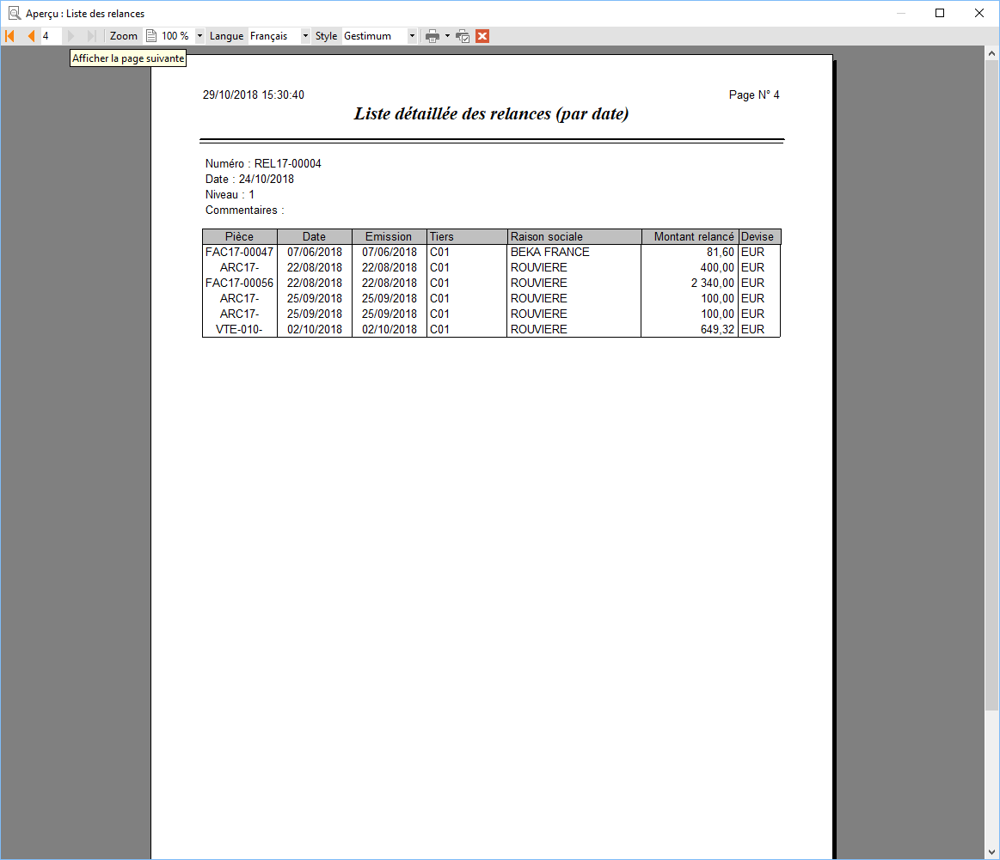
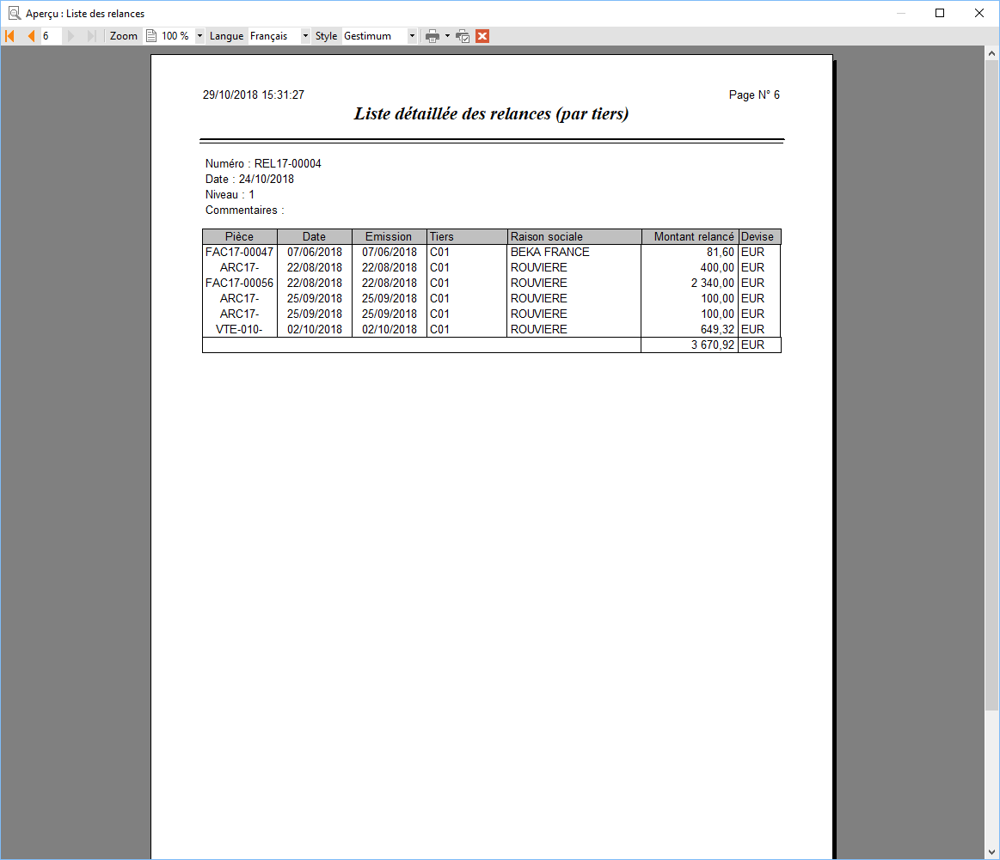
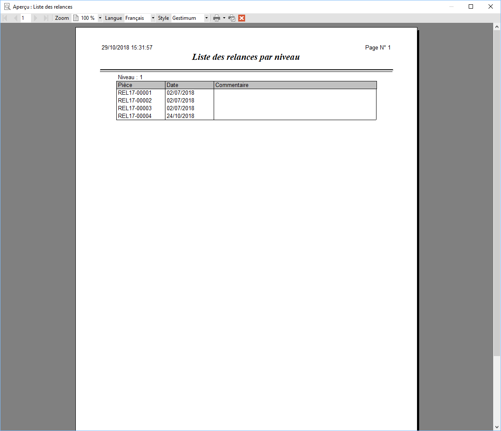

# Impression des relances effectuées

L’impression de la liste des relances (historique) peut s’effectuer 
 à partir du menu contextuel de la grille de l’[historique 
 des relances](../RelancesEffectuees.md).

 

Les modèles proposés sont des modèles ReportMaker (situés dans le répertoire 
 Modèles).

 

Cette boite d’impression a un comportement commun à toutes les autres.

## Options

Vous avez la possibilité de filtrer :

* les périodes
* les niveaux de 
 relance : Tous, 1er, 2ème, 3ème ou Avant relance

 

## Liste

## Liste détaillée par date

## Liste détaillée par tiers

## Liste détaillée par tiers avec totaux

## Liste par niveau

