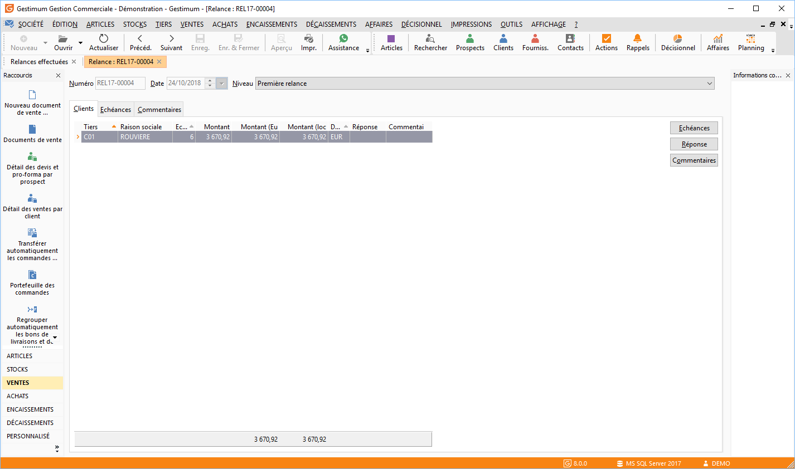

# Relance effectuée

La fiche relance affiche toutes les informations relatives aux [relances 
 générées](../../Relancer/Relancer.md).

## Entête

Elle indique en entête le numéro, la date de réalisation et le niveau 
 de la relance

 
  
Trois onglets vous permettent de visualiser le détail de la relance 
 :

* Onglet Clients: 
 Les clients relancés,
* Onglet Échéances 
 : Toutes les échéances relancées,
* Onglet Commentaires 
 : Le commentaire saisi lors de la réalisation de la relance.

 

Par le menu contextuel ou bouton :

* Échéances ou le 
 bouton , vous avez la possibilité d’ouvrir la liste des relances,
* Réponse client 
 ou le bouton , vous avez la possibilité de conserver à titre d'information 
 la réponse de chaque client de la relance, suite au courrier de relance 
 envoyé,

* Commentaires ou 
 le bouton , vous avez la possibilité de saisir des commentaires supplémentaires 
 associés à chaque client de la relance, suite au courrier envoyé.

 

Le menu contextuel vous permet également d’enregistrer les modifications 
 effectuées sur la fiche relance et d’imprimer celle-ci.

