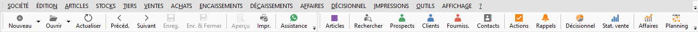
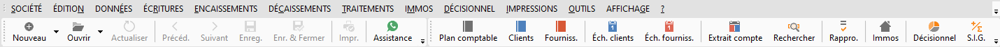
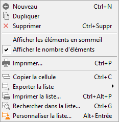
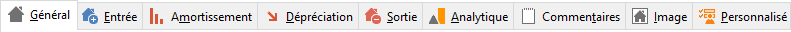
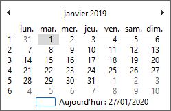
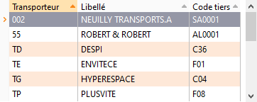

# Raccourcis clavier

## Fenêtres

| Raccourci | Fonction |
| Alt + F4 | Ferme la boite de dialogue active ou l'application en l'absence de boite de dialogue |
| Ctrl + F4 | Ferme la fenêtre enfant active en l'absence de boite de dialogue |
| Entrée | Clique sur le bouton par défaut de la boite de dialogue, celui qui est en gras |
| Esc | Ferme la boite de dialogue active, comme un bouton Annuler ou Fermer |
| Ctrl + Tab ou Ctrl + F6 | Sélectionne la fenêtre enfant ouverte suivante |
| Ctrl + Shift + Tab ou Ctrl + Shift + F6 | Sélectionne la fenêtre enfant ouverte précédente |
| Tab ou Shift + Tab | Déplace le curseur dans la zone suivante ou précédente de la fenêtre active |
| Alt + Espace | Ouvre le menu système de la fenêtre principale |

## Menu principal

 

 

| Raccourci | Fonction |
| Alt ou F10 | Sélectionne "SOCIÉTÉ" dans le menu principal |
| Ctrl + N ou F11 | Clique sur le bouton "Nouveau" |
| Ctrl + O ou Ctrl + F12 | Clique sur le bouton "Ouvrir" |
| Ctrl + S ou F12 | Clique sur le bouton "Enreg." |
| Ctrl + Shift + S ou Alt + F12 | Clique sur le bouton "Enr. & Fermer" |
| Ctrl + P ou Shift + Ctrl + F12 | Clique sur le bouton "Impr." |
| F6 ou Alt + Flèche droite | Clique sur le bouton "Suivant" |
| Shift + F6 ou Alt + Flèche gauche | Clique sur le bouton "Précédent" |

## Menus contextuels

 

| Raccourci | Fonction |
| Clic droit ou Shift + F10 | Affiche le menu contextuel de la fenêtre enfant active, ou de la zone active |
| Flèche basse ou Flèche haute | Sélectionne l'élément de menu suivant ou précédent |
| Flèche droite ou Flèche gauche | Ouvre ou ferme le sous-menu s'il y en a un |
| Esc | Ferme le menu contextuel |
| Entrée | Clique sur l'élément de menu sélectionné |
| Clic droit + F1 | Affiche l'aide de l'élément de menu sélectionné |

 

Les zones qui ont en général un menu contextuel sont : la fenêtre, la grille, l’image, la zone de saisie.

 

Le double clic sur une zone possédant un menu contextuel permet parfois, sans ouvrir le menu contextuel, de faire un clic dans le menu contextuel sur l'élément de menu qui est en gras.

## Onglets

 

| Raccourci | Fonction |
| Flèche droite ou Flèche gauche | Sélectionne l'onglet suivant ou précédent celui sélectionné |
| Début ou Fin | Sélectionne le premier ou le dernier onglet |

## Case à cocher

 

 

| Raccourci | Fonction |
| Espace | Coche ou décoche la case |

## Zone de choix unique

 

 

| Raccourci | Fonction |
| Flèche gauche ou Flèche droite | Passe au choix suivant ou au choix précédent |

## Zone de saisie de nombre

 

| Raccourci | Fonction |
| Flèche haute ou Flèche basse | Augmente ou diminue de 1 le nombre |

## Zone de saisie de date

 

| Raccourci | Fonction |
| Flèche haute ou Flèche basse | Augmente ou diminue de 1 jour la date |
| + ou - | Augmente ou diminue de 1 jour la date |
| A ou T | Saisie automatiquement la date du jour |
| F4 ou Alt + Flèche basse | Ouvre le calendrier |

## Calendrier

 

| Raccourci | Fonction |
| Flèche droite ou Flèche gauche | Avance ou recule d'un jour |
| Flèche basse ou Flèche haute | Avance ou recule d'une semaine |
| Ctrl + Flèche droite ou Ctrl + Flèche gauche | Avance ou recule d'un mois |
| Page suivante ou Page précédente | Avance ou recule d'un mois |
| Fin ou Début | Avance au dernier jour du mois ou recule au premier jour du mois |
| Clic ou Entrée | Ferme le calendrier et recopie la date sélectionnée dans la zone de saisie de date |
| Esc | Ferme le calendrier sans modifier la date de la zone de saisie |

## Zone de sélection avec une liste déroulante simple

 

| Raccourci | Fonction |
| F4 ou Alt + Flèche basse | Ouvre ou ferme la liste déroulante |
| Flèche basse ou Flèche haute | Sélectionne l'élément suivant ou précédent de la liste, qu'elle soit ouverte ou fermée |
| Page suivante ou Page précédente | Avance ou recule d'une page dans la liste, qu'elle soit ouverte ou fermée |
| Fin ou Début | Sélectionne le dernier ou le premier élément de la liste, qu'elle soit ouverte ou fermée |

## Sélection multiple

| Raccourci | Fonction |
| Clic ou Espace | Sélectionne ou désélectionne |
| Ctrl + Clic | Ajoute la ligne courante à la sélection |
| Shift + Flèche basse­ ou Shift + Flèche haute | Ajoute la ligne suivante ou la ligne précédente à la sélection |
| Shift + Clic | Ajoute toutes les lignes entre la ligne courante et la ligne cliquée |
| Ctrl + A | Sélectionne tout |

## Zone de saisie et sélection avec une liste déroulante de données (affaires, articles, tiers, etc)

 

 

| Raccourci | Fonction |
| F4 | Ouvre ou ferme la liste déroulante |
| Alt + Flèche basse | Ouvre la liste déroulante |
| Shift + F4 | Ouvre la fenêtre de liste comme le bouton "..." |
| Ctrl + F ou F3 | Ouvrir la fenêtre de recherche comme le bouton "Loupe" lorsqu'il y en a un, sinon la fenêtre de liste comme le bouton "..." |
| Esc | Ferme la liste sans modifier la zone de saisie |
| Entrée | Ferme la liste en recopiant la sélection dans la zone de saisie |
| Flèche basse ou Flèche haute | Sélectionne l'élément suivant ou précédent de la liste déroulante |
| Page suivante ou Page précédente | Avance ou recule d'une page dans la liste déroulante |
| Fin ou Début | Sélectionne le dernier ou le premier élément de la liste déroulante |
| Ins | Ouvre la fenêtre de création d'un nouvel élément dans la liste déroulante |
| F2 | Ouvre la fenêtre de modification de l'élément sélectionné dans la liste déroulante |

## Liste

 

| Raccourci | Fonction |
| Flèche basse ou Flèche haute | Avance ou recule d'une ligne |
| Ctrl + Flèche basse ou Ctrl + Flèche haute | Avance en fin de page ou recule en début de page |
| Page suivante ou Page précédente | Avance ou recule d'une page |
| Fin ou Debut | Avance en fin de liste ou recule en début de liste |
| Flèche droite ou Flèche gauche | Déplace le curseur dans la colonne de droite suivant ou dans la colonne de gauche précédente |
| Tab ou Entrée | Déplace le curseur dans la prochaine colonne de droite modifiable, ou à la ligne suivante si plus aucune n'est modifiable |
| Ctrl + Entrée | Déplace le curseur dans la 1ère colon en de la ligne suivante |
| Shift + Tab | Déplace le curseur dans la précédente colonne de gauche modifiable |
| Ctrl + Début ou Ctrl + Fin | Déplace le curseur dans la première ou dernière colonne de la ligne |
| F2 | Affiche la zone de saisie de la colonne sélectionnée |
| Esc | Soit annule la modification en cours et masque la zone de saisie, si la zone de saisie était affichée
Soit annule toutes les modifications apportées à la ligne en cours, si aucune zone de saisie n'était affichée |
| Ins | Insère une nouvelle ligne au dessus de la ligne courante |
| Ctrl + Suppr | Supprime la ligne |
| Ctrl + E | Exporte la liste dans un fichier texte |
| Ctrl + L | Exporte la liste dans un fichier Excel |
| Ctrl + X | Exporte la liste dans un fichier XML |

## Comptabilité

| Raccourci | Fonction |
| F9 | Permet d'affecter au champ sélectionné la valeur de la ligne précédente en saisie d'écritures uniquement |
| F4 | Si sélection sur le champ "échéance", la touche F4 permet d'ouvrir l'échéancier Multi sélection (exemple : Lettrage manuel) |

## Sélection multiple

| Raccourci | Fonction |
| Ctrl + Clic ou Espace | Sélection ou déselection |
| Ctrl + A | Tout sélectionner |
| Shift + Ctrl + A | Tout déselectionner |
| Shift + Flèche haute ­ ou Shift + Flèche basse | Sélection ou déselection en lot |

