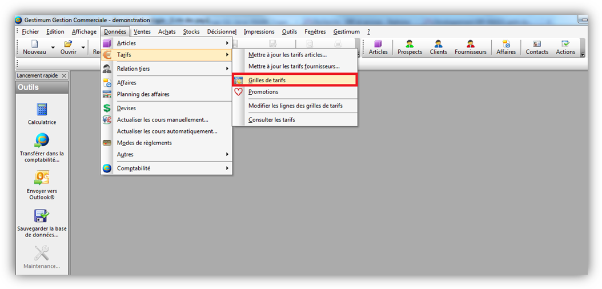

# Traçabilité

Avec Gestimum ERP, il est possible de «tracer» certaines informations 
 enregistrées sur le logiciel

## Créé le et créé par

* Exemple: allez 
 dans La «liste des documents de vente»

* Faites clic droit 
 «propriétés de la grille»

* Recherchez les 
 champs «Créé le» et «Créé par» à gauche dans les colonnes disponibles, 
 sélectionnez les puis cliquez sur la flèche simple au milieu de la 
 fenêtre pour les insérer dans les colonnes sélectionnées à droite. 
 Enfin cliquez sur «OK» en bas

* Sur la liste de 
 vos «documents de vente» apparaîtra ces deux champs qui vous indiqueront 
 qui a créé ces documents

* Vous retrouverez 
 ces champs dans les parties suivantes du logiciel
* + Dans la liste 
	 des actions
	+ Dans la liste 
	 des Prospects – Clients – Fournisseurs
	+ Dans la liste 
	 des contacts
	+ Dans la liste 
	 des affaires
	+ Dans la liste 
	 des documents de vente – achat – stock – Inventaire
	+ Dans les lignes 
	 de documents de vente – achat – stock – Inventaire
	+ Dans la liste 
	 des budgets
	+ Dans les conditions 
	 de visibilités
	+ Dans les guides 
	 d’Écriture
	+ Dans les immobilisations
	+ Dans les rapprochements 
	 bancaires
	+ Dans les modèles 
	 de ventilation analytique
	+ Dans les sections 
	 analytiques

## Modifié le» et «modifié par»

* Exemple: Allez 
 dans «Données – tarifs – grilles de tarifs»

* Faites clic droit 
 «propriétés de la grille»

* Recherchez les 
 champs «Modifié le» et «Modifié par» à gauche dans les colonnes disponibles, 
 sélectionnez les puis cliquez sur la flèche simple au milieu de la 
 fenêtre pour les insérer dans les colonnes sélectionnées à droite. 
 Enfin cliquez sur «OK» en bas

* Sur la liste de 
 vos «grilles de tarifs» apparaîtra ces deux champs qui vous indiqueront 
 qui a modifié ces documents

* Vous retrouverez 
 ces champs dans les parties suivantes du logiciel
* + Dans la liste 
	 des actions
	+ Dans la liste 
	 des familles d’article
	+ Dans la liste 
	 des sous familles d’article
	+ Dans la liste 
	 des articles
	+ Dans la liste 
	 des banques
	+ Dans la liste 
	 des comptes bancaires
	+ Dans la liste 
	 des barèmes
	+ Dans la liste 
	 des budgets
	+ Dans la liste 
	 des comptes
	+ Dans la liste 
	 des abonnements
	+ Dans la liste 
	 des comptes de reporting
	+ Dans la liste 
	 des dépôts
	+ Dans la liste 
	 des devises
	+ Dans la liste 
	 des divisions
	+ Dans la liste 
	 des Écritures
	+ Dans la liste 
	 des échéances
	+ Dans la liste 
	 des frais
	+ Dans la liste 
	 des gammes
	+ Dans la liste 
	 des gammes élémentaires
	+ Dans la liste 
	 des ventilations analytiques des guides
	+ Dans la liste 
	 des journaux
	+ Dans la liste 
	 des modes de règlement
	+ Dans la liste 
	 des natures comptables
	+ Dans la liste 
	 des pays
	+ Dans la liste 
	 des salariés
	+ Dans la liste 
	 des promotions
	+ Dans la liste 
	 des règlements
	+ Dans la liste 
	 des remises en banque
	+ Dans la liste 
	 des impayés
	+ Dans la liste 
	 des relances
	+ Dans la liste 
	 des commerciaux
	+ Dans la liste 
	 des services
	+ Dans la liste 
	 des tarifs
	+ Dans la liste 
	 des glossaires
	+ Dans la liste 
	 des tiers
	+ Dans la liste 
	 des familles de tiers
	+ Dans la liste 
	 des sous familles de tiers
	+ Dans la liste 
	 des TVA
	+ Dans la liste 
	 des utilisateurs
	+ Dans la liste 
	 des villes
	+ Dans la liste 
	 des transporteurs
	+ Dans la liste 
	 des promotions
	+ Dans la liste 
	 des contacts
	+ Dans la liste 
	 des affaires
	+ Dans la liste 
	 des documents de Ventes – Achats – Stocks

## L’origine d’un document

* Sur vos documents 
 (achat/vente) vous pouvez visualiser la provenance d’un devis, d’une 
 commande, d’un bon de livraison, d’une facture ou encore d’un avoir

* Allez dans «Fichier 
 – Paramétrages – préférence de gestion» puis dans l’onglet «Ventes 
 et achats». Cochez la case «Transfert avec origine du document»

* Créez un document 
 de vente (exemple une facture Pro-Forma) puis transférez ce document 
 en devis

* Vus trouverez ensuite, 
 en première ligne de votre devis, le document d’origine. (Ici le PFC 
 correspond à Facture pro forma)

* Également, dans 
 la liste de vos documents de vente ou d’achat, vous pouvez faire apparaître 
 directement le champ dans les colonnes. Allez dans la liste de vos 
 documents de vente ou d’achat puis faites clic droit «Propriétés de 
 la grille». Sélectionnez dans les colonnes disponibles le champ «Pièce 
 d’origine» puis double cliquez dessus afin de le faire apparaître 
 dans les colonnes sélectionnées

* Dans la liste de 
 vos documents le champ apparaîtra et vous informera du dernier document 
 d’origine

* 4 Type de saisie 
 Dans la liste de vos documents d’achat, de vente, de stock ainsi qu’en 
 comptabilité dans vos journaux vous pouvez faire apparaître le type 
 de création d’un document ou d’une écriture

## Les types de saisie en Gestion commerciale

* Transfert
* Transfert automatique
* Duplication
* Saisie
* Importation
* Importation EDI
* Importation Ecommerce
* Regroupement automatique
* Regroupement
* Réapprovisionnement
* Reliquats
* Abonnements contremarque

## Les types de saisie en Gestion comptable

* Transfert comptable 
 de documents
* Saisie standard
* Saisie par pièce
* Saisie guidée
* Saisie au kilomètre
* Déclaration de 
 TVA
* Bascule Euro
* Conversion
* Importation
* Copie
* Extourne contrepassation
* Abonnement
* Clôture exercice
* Import de relevé 
 bancaire

* En comptabilité, 
 allez dans votre journal puis faites clic droit «propriétés de la 
 grille»
* Sélectionnez dans 
 les colonnes disponibles le champ «Traitement ayant créé l’écriture» 
 puis double cliquez dessus afin de le faire apparaître dans les colonnes 
 sélectionnées

* Puis vous pourrez 
 visualiser le type de création de l’écriture

* En gestion commerciale, 
 allez dans la liste des documents de vente puis faites clic droit 
 «propriétés de la grille». Sélectionnez dans les colonnes disponibles 
 le champ «Traitement ayant créé l’écriture» puis double cliquez dessus 
 afin de le faire apparaître dans les colonnes sélectionnées

* Puis vous pourrez 
 visualiser le type de création du document

## L’état d’un document

* Dans vos documents 
 de vente, d’achat, de stock ainsi que dans vos échéances, vos rapprochements 
 bancaires, vos remises en banques, vos émissions de paiements vous 
 pouvez visualiser l’état d’un document

* Allez dans la liste 
 des documents de vente. Faites apparaître via les propriétés de la 
 grille le champ «État». Vous pouvez en haut à droite sélectionner 
 ce que vous voulez voir apparaître dans vos fenêtre (ici les documents 
 en cours, imprimé, transférer partiellement, en préparation EDI, exporté 
 EDI, transféré, comptabilisé, archivé, non comptabilisé)

* En comptabilité 
 vous pouvez, par exemple, visualiser les rapprochements bancaires 
 qui sont «en cours» ou bien «validé»

