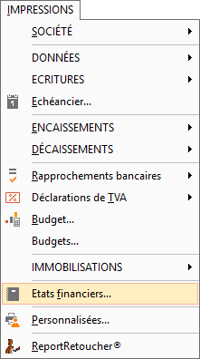
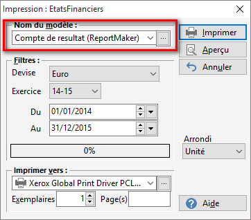
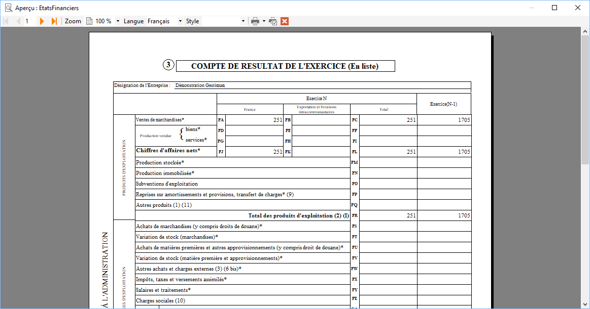
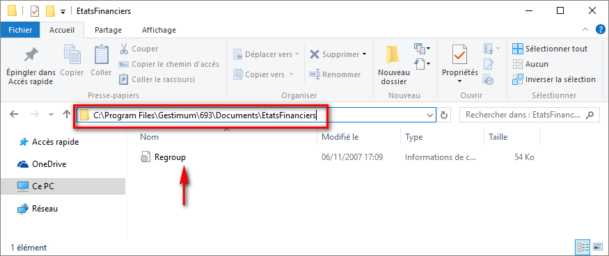
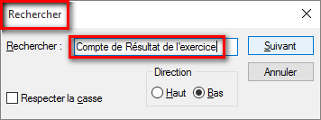
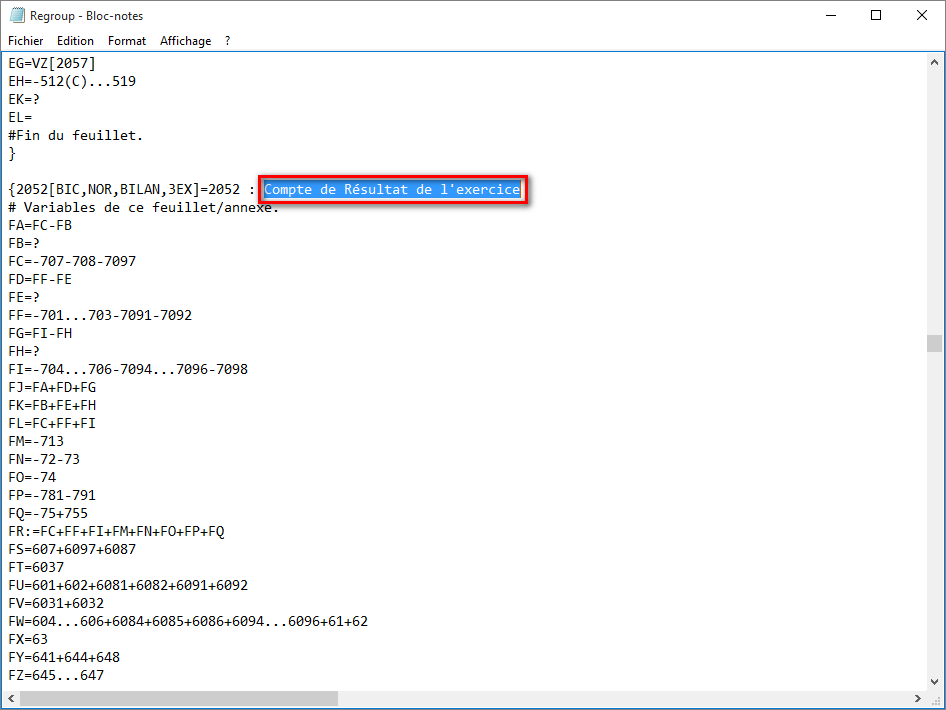
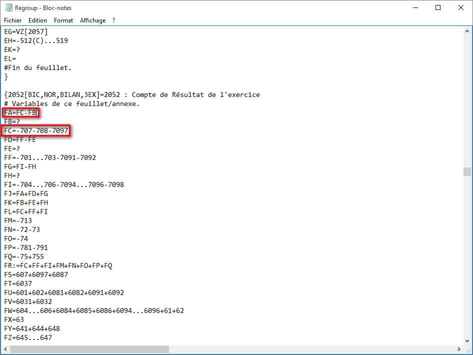
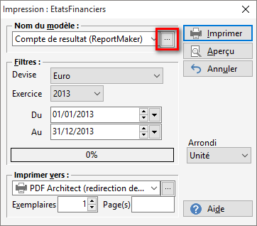
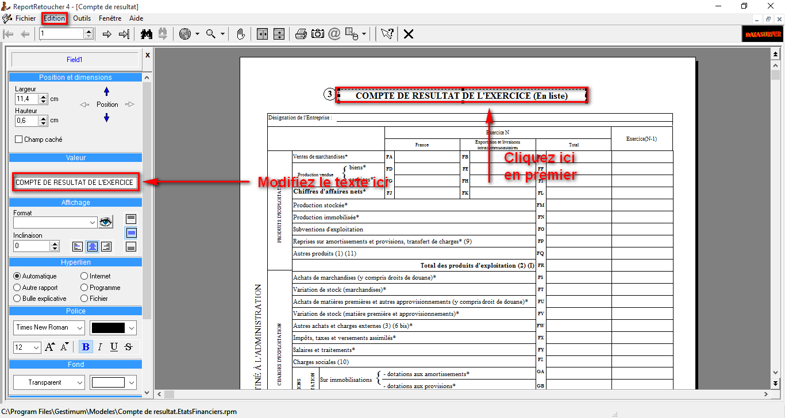

# Compte de résultat
## Menu

Accès aux comptes de résultat "Impressions 
 | États financier" Puis choisir dans le "Nom du modèle" 
 "Compte de résultat".

 

## Modèle

## Période

Sélectionnez votre période.

## Aperçu

Cliquez sur "Aperçu" en haut à droite 
 et vous aurez l’aperçu de votre compte de résultat.

 

## Comptes

Pour modifier les fourchettes de compte, il 
 vous faut aller dans le répertoire où vous avez installé Gestimum ERP 
 et ouvrir le fichier qui s’appelle "Regroup. inf"

 

Exemple: C:\Program Files\Gestimum\Documents\ÉtatsFinanciers

 

 

Faites clic droit puis "Ouvrir avec" 
 et choisissez "Bloc note"

 

Recherchez en faisant "Ctrl + F" et 
 écrivez "Compte de Résultat d’exercice"

 

 

Automatiquement vous allez vous retrouver sur 
 la ligne qui nous intéresse.

 

 

Ici vous allez pouvoir modifier vos formules 
 de calcul si vous le souhaitez

 

 

Une fois modifiées vous enregistrez et les modifications 
 seront effectives lors de la réouverture de votre compte de résultat

 

Si vous souhaitez modifier le nom de votre modèle 
 vous pouvez renommer en allant dans "Impressions – États financier" 
 puis cliquer sur les 3 petits points de votre modèle Compte de résultat

 

 

Le logiciel va ouvrir "Report retoucher" 
 puis cliquez sur Édition – Afficher la barre de conception"

 

Cliquez sur la zone "Compte de résultat 
 de l’exercice" à droite puis dans "valeur" à gauche vous 
 pouvez renommer le titre.

 

****
 

Si vous enregistrez et que vous retournez à 
 l’aperçu du compte de résultat la modification sera effective

