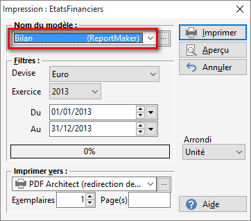
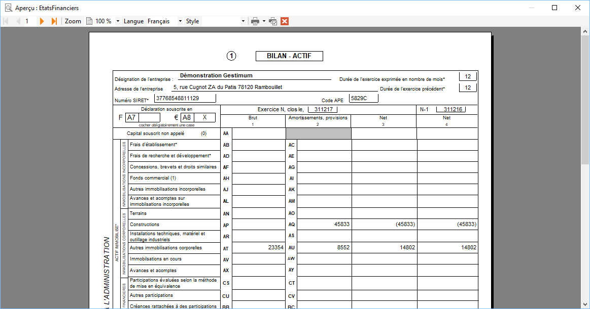
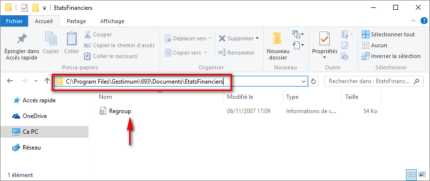
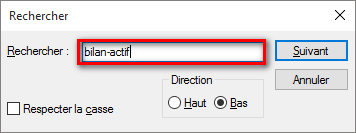
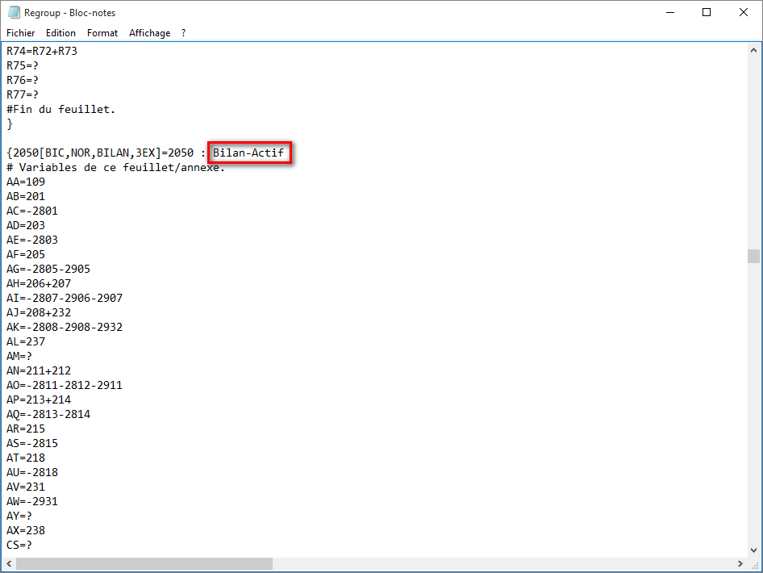
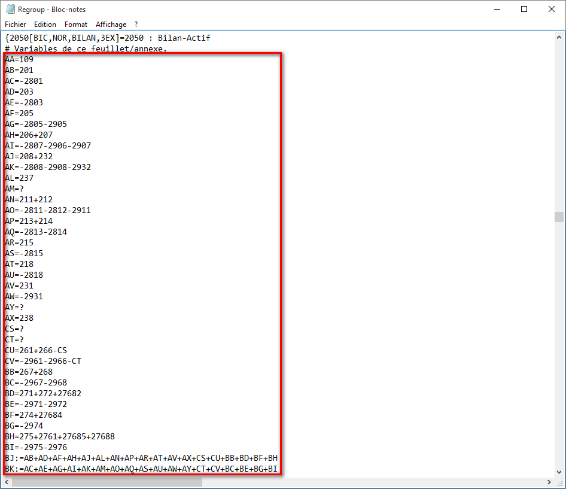
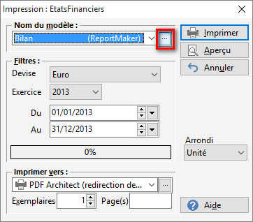
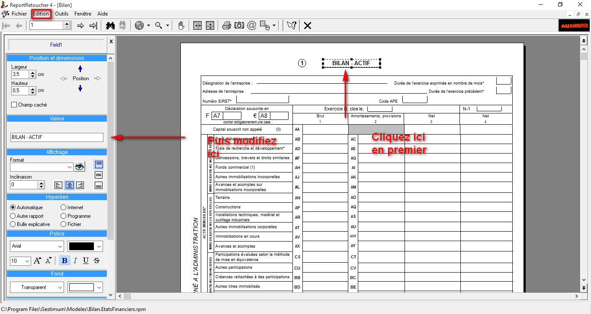

# Bilan

## Menu

Accès aux "Bilan" via "Impressions | États financier" 
 puis choisir dans le "Nom du modèle" "Bilan"

 

## Modèle

## Période

Sélectionnez votre période

## Aperçu

Cliquez sur "Aperçu" en haut à droite 
 et vous aurez l’aperçu de votre bilan

 

## Champs

Pour modifier les champs de votre compte de 
 résultat il vous faut aller dans le répertoire où vous avez installé Gestimum 
 ERP et ouvrir le fichier qui s’appelle "Regroup. Inf"

 

Exemple: C:\Program Files\Gestimum\4.8.0 build 
 569\Documents\ÉtatsFinanciers

 

 

Faites clic droit puis "Ouvrir avec" 
 et choisissez "Bloc note"

 

Recherchez en faisant "Control + F" 
 et écrivez "Bilan-actif " et ensuite "bilan-passif"

 

 

Automatiquement vous allez vous retrouver sur 
 la ligne qui nous intéresse.

 

 

Ici vous allez pouvoir modifier vos formules 
 de calcul si vous le souhaitez

 

 

Une fois modifiée vous enregistrez et les modifications 
 seront effectives lors de la réouverture de votre bilan

 

Si vous souhaitez modifier le nom de votre modèle 
 vous pouvez renommer en allant dans "Impressions – États financier" 
 puis cliquer sur les 3 petits points de votre modèle bilan

 

 

Le logiciel va ouvrir "Report retoucher" 
 puis cliquez sur "Édition – Afficher la barre de conception"

 

Cliquez dur la zone "Compte de résultat 
 de l’exercice" à droite puis dans "valeur" à gauche vous 
 pouvez renommer le titre.

 

****
 

Si vous enregistrez et que vous retournez à 
 l’aperçu du bilan la modification sera effective

