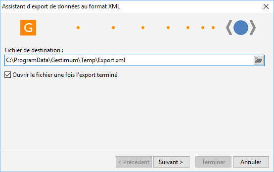
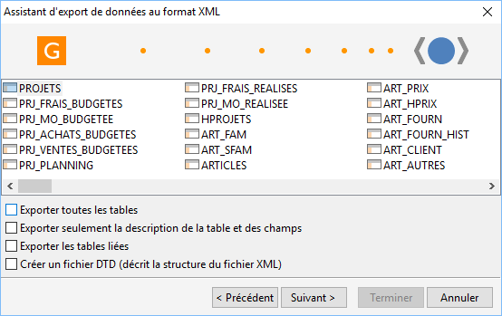
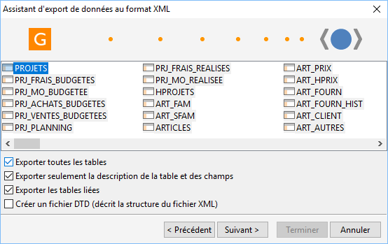

# Export de données au format XML

Dans un premier temps il faut sélectionner l'emplacement où sera stocké 
 le fichier.

 

 

Ensuite, vous avez la possibilité de sélectionner une ou plusieurs tables 
 à exporter.

 

 

L'option "Exporter toutes les tables" vous permet de sélectionner 
 toutes les tables d'un coup.

 

Si vous ne cochez aucune autre option, alors vous pourrez exporter les 
 données de la base Gestimum au format XML. Attention le traitement peut 
 être long et le fichier généré peut être très volumineux.

 

Il est également possible d'exporter le dictionnaire de la base Gestimum 
 qui contiendra le descriptif des champs et clés associées de chaque table 
 sous forme de tableaux. Des fichiers avec une extension XML et XLS sont 
 générés.

Pour obtenir à nouveau cette information en format XML pur, il suffit 
 par l'explorateur Windows de sélectionner dans le menu contextuel du fichier 
 XML sélectionné, l'option Modifier puis supprimer la ligne <?xml-stylesheet type="text/xsl" href="Export.xsl".

 

