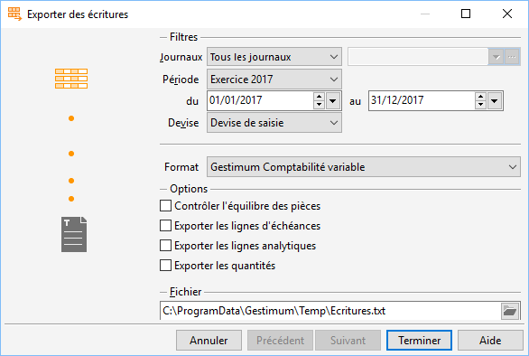

# Export d'écritures

L’exportation des écritures (Ecritures du menu Outils + Exporter) permet 
 à tout moment de créer un fichier txt avec toutes les écritures souhaitées 
 pour une période précise.

 

Ce fichier est au format Gestimum. Les seules modulations possibles 
 sont celles liées aux informations particulières (gestion des quantités 
 et/ou échéances et/ou analytiques).

## Modalités pour pouvoir effectuer l'exportation des écritures

### Droit

Vous devez avoir sélectionné par le menu SOCIETE + Utilisateurs le droit 
 pour pouvoir lancer ce traitement. Le droit "Écritures" se situe 
 dans l’options "Outils" + "Exportation de données".

## Traitement de l'exportation

Un assistant vous guide dans les différentes étapes de l’exportation 
 des écritures :

* Paramétrage du 
 fichier texte,
* Lancement de l’exportation,
* Information sur 
 l’export.

## Paramétrage du fichier texte

 

### Sélection des Écritures à exporter

La sélection des écritures à exporter s’effectue par les journaux, la 
 période ainsi que les informations et lignes particulières.

 

Vous devez obligatoirement sélectionner un journal et la période pour 
 laquelle vous souhaitez exporter les écritures.

 

Si votre dossier gère les quantités et/ou les échéances et/ou l'analytique, 
 vous avez la possibilité d’exporter ces informations. Lorsque ces gestions 
 particulières sont sélectionnées, l’export génère automatiquement un champ 
 supplémentaire pour les quantités et les lignes correspondantes aux gestions 
 des échéances et de l’analytique suivant le format Gestimum.

### Options

Vous pouvez exporter les écritures suivant 3 niveaux de devise :

* Devise de saisie,
* Devise du dossier,
* Devise locale.

 

De plus, vous avez la possibilité de lancer le contrôle de l’équilibre 
 des pièces que vous exportez.

### Fichier d’exportation

Vous devez indiquer le chemin et le nom du fichier qui contiendra les 
 Écritures exportées.

 

Le chemin du fichier, par défaut, est celui paramétré dans les préférences 
 utilisateurs, onglet Dossier.

 

Le nom du fichier par défaut est écritures.txt.

## Lancement de l’exportation

Lorsque vous avez fini le paramétrage du fichier texte, vous devez cliquer 
 sur le bouton Terminer ou Alt+T afin de lancer l’exportation des écritures.

## Informations sur l’export

Si vous avez sélectionné l’option sur le contrôle de l’équilibre des 
 pièces, et qu’au cours du traitement un déséquilibre est trouvé : vous 
 aurez un message de confirmation. Celui-ci vous informera qu’il existe 
 au moins une pièce déséquilibrée (avec le nom du journal) et vous demandera 
 si vous voulez continuer ou stopper l’export.

 

A la fin du traitement, un message d’information vous indique le nombre 
 d’Écriture exportées.

