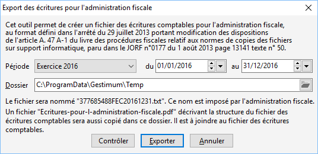
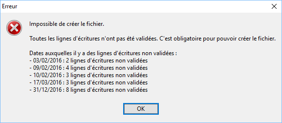
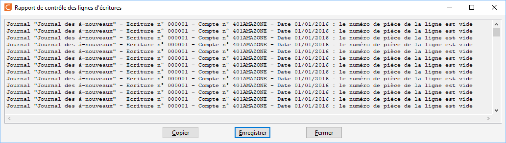

# Export d'écritures pour l'administration fiscale
Cet outil permet d'exporter le fichier des écritures comptables (FEC) 
 pour l'administration fiscale.

 

Ce fichier peut vous être demandé à n'importe quel moment lors d'un 
 contrôle fiscal.

 

 

Vous ne pouvez exporter que des écritures qui ont été préalablement 
 validées (rendue inaltérables). Pour cela vous avez 2 possibilités :

1. Dans le cas d'un exercice en cours : valider uniquement les 
 écritures : cela vous permet de pouvoir continuer à saisir dans le 
 jour, mais les écritures validées ne pourront plus être modifiées 
 ;
2. Valider le journal pour une période données : dans ce cas, il 
 ne vous sera plus possible de saisir des écritures dans les journaux 
 concernés.

 

Si les écritures n'ont été, à minima validées, vous aurez ce message 
 :

 

 

Vous pouvez intervenir sur les options suivantes :

* le choix de la période,
* l'endroit où sera stocké le 
 fichier.

 

Le bouton "Contrôler" vous permet de vérifier que vos écritures 
 sont conformes au format défini. Les points examinés sont :

* l'absence de libellé,
* l'absence de numéro de pièce,
* les montants Débit + Crédit 
 = 0,
* les comptes comptables commencent 
 bien par 3 caractères numériques.

 

Si tous ces points ne sont pas valides, votre fichier sera rejeté par 
 le contrôleur.

 

Exemple de rapport :

 

