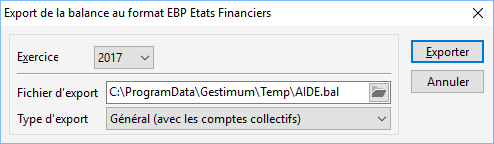

# Export de la balance pour EBP Etats Financiers

Pour exporter votre balance au format EBP États Financiers, lancez la 
 commande Export Liasses Fiscales EBP du menu Outils/Exporter.

 

Vous pouvez modifiez éventuellement le répertoire 
 et le nom du fichier à générer. 
 Le répertoire par défaut est celui paramétré dans les préférences de la 
 société. Par exemple : C:\Program Files\Gestimum\Temp\«nomdudossier».

 

Vous avez également la possibilité de choisir le type de la balance 
 : Auxiliaire ou Générale.

 

Lorsque vous cliquez sur Exporter, le fichier de la balance est généré 
 dans le répertoire des fichiers temporaires paramétré dans les préférences 
 de l'utilisateur.

 

 

Ensuite, le fichier peut être exploité par EBP États Financiers.

