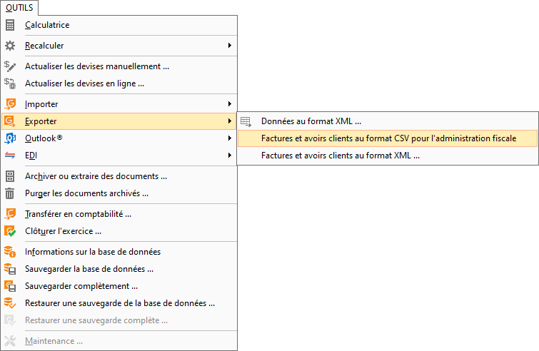
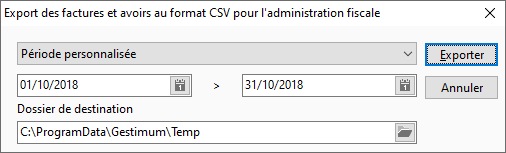
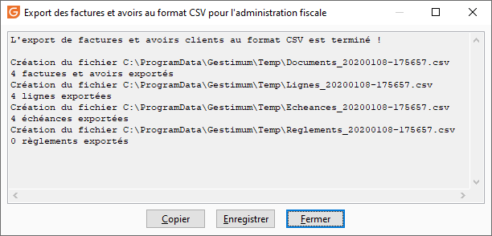

# Export des factures et avoirs clients au format CSV pour l'administration fiscale
Conformément au BOI-TVA-DECLA-30-10-30-20180704 vous devez remplir un 
 critère de conservation (durée de 6 ans cf. article L. 102 B du LPF).

 

C'est à dire, être en mesure de respecter toutes les obligations liées 
 au contrôle fiscal et entre autres :

Les éléments de la PAF si les factures ne sont 
 pas électroniques : tout ce qui concoure à la réalisation de la transaction 
 (BC, BL, …)

 

Pour cela, vous avons mis en place un format d’export des documents 
 de vente au format CVS comportant les éléments cités dans le BOFiP-TVA-DECLA-30-10-30-§ 
 50-04/07/2018 : 

* Le numéro de pièce
* La date (année, mois, jour, heure, minute)
* Le montant total TTC
* Le détail des articles ou prestation (libellé, quantité, prix 
 unitaire, total HT de la ligne, taux de TVA associé)
* Toutes les données liées à la réception (immédiate ou attendue) 
 du paiement en contrepartie (mode de règlement notamment)

 

Vous pouvez faire cet export par 2 moyens.

## Fenêtre

Cette fenêtre est accessible par le menu OUTILS 
 | Exporter | Factures et avoirs clients au format CSV pour l'administration 
 fiscale.

 

 

 

## Tâche en ligne de commande

La tâche en ligne de commande est "ExporterFacturesClientsCSV".

 

Elle attend un fichier de paramètres fournissant le dossier de destination, 
 la date début et la date de fin :

 

[Tâche]

Nom=ExporterFacturesClientsCSV

Journal=ExporterFacturesClientsCSV.log

 

[Société]

Fichier=C:\ProgramData\Gestimum\DEMO.Gestimum

Utilisateur=DEMO

Deconnecter=Non

Exclusif=Non

 

[Paramètres]

DossierDestination=C:\ExportFacturesClientsCSV

DateDebut=01/10/2018

DateFin=31/10/2018

