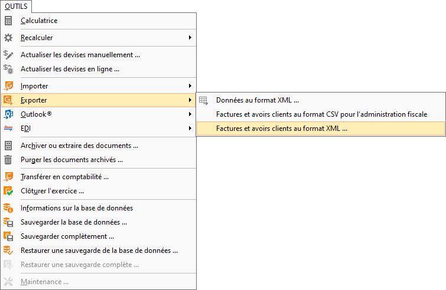
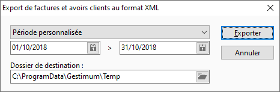
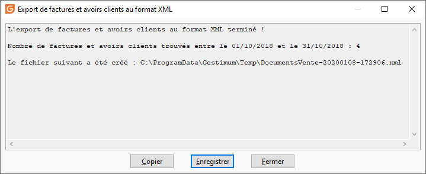

# Export des factures et avoirs clients au format XML

Pour cela, vous avons mis en place un format d’export des documents de vente au format XML comportant les éléments suivants :

* Numéro de pièce
* Date (année, mois, jour, heure, minute)
* Montant total TTC
* Détail des articles ou prestations (libellé, quantité, prix unitaire, total HT de la ligne, taux de TVA associé)
* Données liées à la réception (immédiate ou attendue) du paiement en contrepartie (mode de règlement notamment)

 

Vous pouvez faire cet export par 2 moyens.

## Fenêtre

La fenêtre est accessible par le menu OUTILS| Exporter | Factures et avoirs clients au format XML.

 

 

 

## Tâche en ligne de commande

La tâche en ligne de commande est "ExporterFacturesClientsXML".

 

Elle attend un fichier de paramètres fournissant le dossier de destination, la date début et la date de fin :

 

[Tâche]

Nom=ExporterFacturesClientsXML

Journal=ExporterFacturesClientsXML.log

 

[Société]

Fichier=C:\ProgramData\Gestimum\DEMO.Gestimum

Utilisateur=DEMO

Deconnecter=Non

Exclusif=Non

 

[Paramètres]

DossierDestination=C:\ExportFacturesClientsXML

DateDebut=01/10/2018

DateFin=31/10/2018

 
