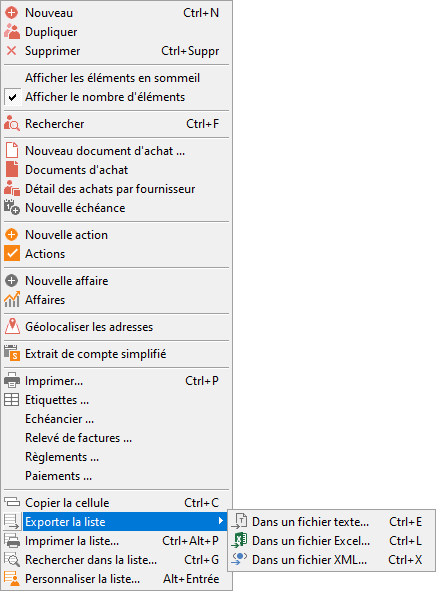

# Exporter une liste

Toutes les listes peuvent être exportées.

 

Cette fonction est disponible uniquement pour les listes.

 

Elle est accessible par le menu contextuel de toutes les listes.

 

Par exemple, voici le menu contextuel de la liste des fournisseurs :

 

 

Vous avez la possibilité de d’exporter un liste au [format 
 texte](../1/ExportListeFormatTexte.md), au [format Excel](../2/ExportListeFormatExcel.md) 
 ou au [format XML](../3/ExportListeFormatXML.md).

 

Toutes les fenêtres d'export ont un comportement commun.

 

Les champs exportés sont ceux présents dans la liste au moment de la 
 demande de l’export.

