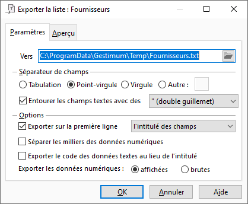

# Paramètres de l'export de liste au format CSV

Le paramétrage de l’export d'une liste au format texte s’effectue depuis l’onglet "Paramètres" de l’export.

 

 

Cet onglet vous permet de déterminer la structure du fichier que vous souhaitez obtenir.

## Fichier de destination

Vous devez indiquer le nom et l'emplacement du fichier à créer.

 

Le chemin est par défaut celui paramétré dans la zone "Dossier des fichiers temporaires" dans les préférences utilisateur.

## Format d’exportation

Il détermine le paramétrage des lignes de votre fichier à créer.

 

Vous avez le choix entre plusieurs séparateurs de champs notamment : Tabulation, Point-virgule, Virgule ou Autre.

 

Vous pouvez également choisir de :

 

* entourer ou non les champs textes avec un simple guillemet (‘) ou un double guillemet (")

 

* exporter ou non sur la première ligne du fichier le nom des champs ou l’intitulés des champs

 

* laisser le séparateur de milliers pour les champs numériques

 

* exporter ou non le code au lieu de l’intitulé pour les champs liés

 

Par exemple : Pour la liste des pays, le code du pays "PAY\_CODE" est "DE" au lieu de "Allemagne".

 

* exporter les valeurs affichées ou brutes

 

Les valeurs affichées ont un format spécifique pour l'affichage dans les listes à l'écran, comme par exemple les dates avec un format pour dates, les montants avec un format pour montants, etc

 

Les valeurs brutes ne seront pas formatées avec un format d'affichage.

## Visualisation avant l’export

Si vous souhaitez avoir un aperçu du fichier que vous allez exporter, vous devez cliquer sur l’[onglet Aperçu](ApercuFichierTexte.md).

 

