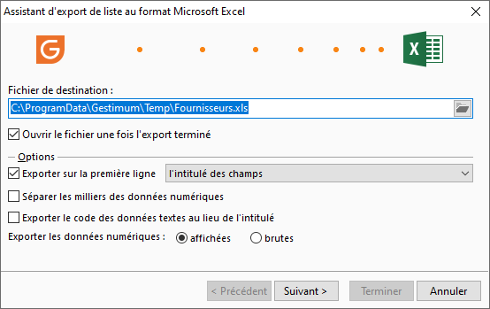

# Export de liste au format Excel

Pour effectuer l’exportation d’une liste au format XLS, vous devez déterminer 
 le paramétrage des lignes d’enregistrement de votre fichier à exporter.

 

 

Vous devez définir la structure du fichier que vous souhaitez :

* Exporter ou non sur la première ligne du fichier le nom des 
 champs ou l’intitulés des champs ;
* Laisser le séparateur de milliers pour les champs numériques ;
* Exporter ou non le code des données textes au lieu de l’intitulé 
 (Par exemple : Pour la liste des pays, le code du pays "PAY\_CODE" 
 est "DE" au lieu de "Allemagne")
* Exporter les données numériques (Valeurs affichées : certaines 
 valeurs ont un format spécifique pour l'affichage dans les grilles 
 (ex : format des dates ...) ; Valeurs brutes : = valeurs 
 stockées dans la table).

 

Suite à la demande de l’export de la grille au format xls, vous accédez 
 automatiquement à votre fichier exporter sous Excel. Attention se fichier 
 n’est pas sauvegardé par défaut, vous devez obligatoirement l’enregistrer 
 dans Excel pour le conserver.

