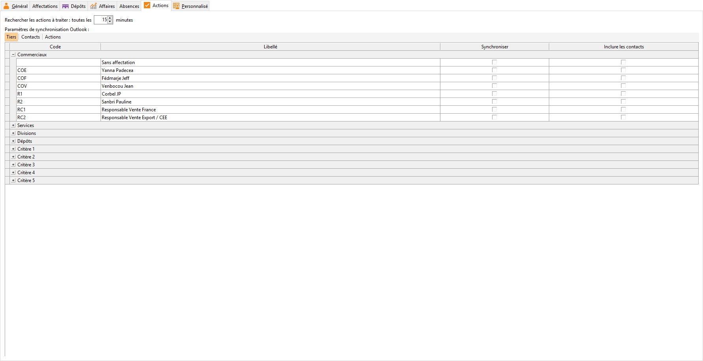

# Paramétrage du salarié
Il faut aller dans le menu SOCIETE | Salariés.

 

 

Dans la fiche salarié, il faut sélectionner les éléments dont vous souhaitez 
 synchroniser les données vers Outlook® 
 dans l'onglet Actions.

