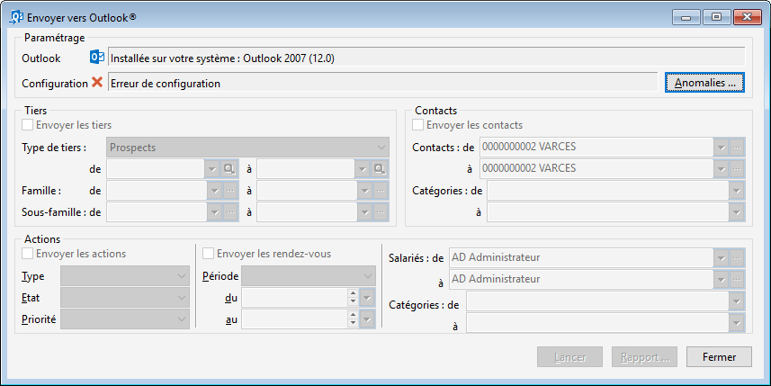

# Synchronisation des données
Pour synchroniser vos données vers Outlook®, 
 il faut ouvrir l'outil qui est dans le menu OUTILS 
 | Outlook® | Envoyer.

 

 

Vous pouvez ensuite sélectionnez les données que vous souhaitez envoyer 
 dans Outlook® avant de 
 lancer la synchronisation.

