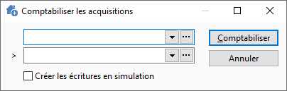
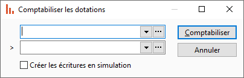
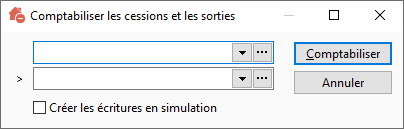

# Outils de comptabilisation en masse

Depuis le menu IMMOS, vous pouvez 
 accéder à 3 outils de comptabilisation en masse.

## Comptabiliser les acquisitions

 

Il est possible de générer des écritures en simulation en cochant l'option 
 mise à disposition dans la fenêtre.

## Comptabiliser les dotations

 

Il est possible de générer des écritures en simulation en cochant l'option 
 mise à disposition dans la fenêtre.

## Comptabiliser les cessions et les sorties

 

Il est possible de générer des écritures en simulation en cochant l'option 
 mise à disposition dans la fenêtre.

