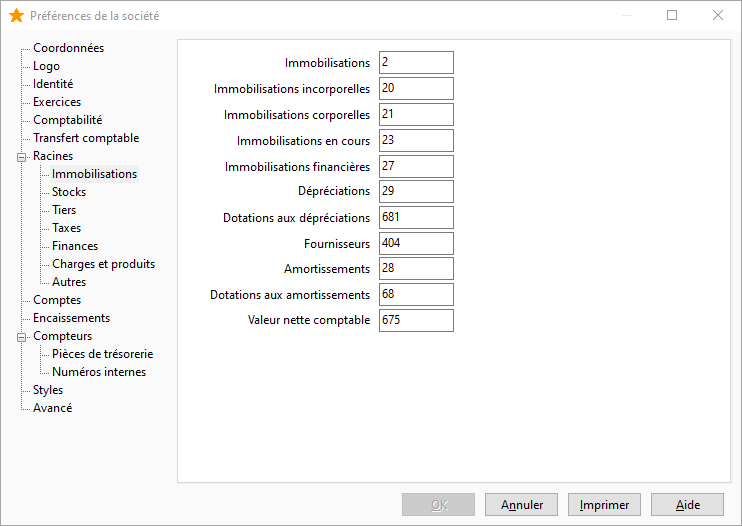

# Paramétrages comptables

Plusieurs paramétrages sont nécessaires à la mise en service du module immobilisations de Gestimum ERP.

 

Attention ! Le module immobilisations est incompatible avec un paramétrage des exercices comptable de type "Exercices personnalisés"

Accessible depuis le menu SOCIETE|Paramétrages|Préférences de la société|Exercices 

 

##### La définitions des racines de comptes d'immobilisations :

Accessible depuis le menu SOCIETE|Paramétrages|Préférences de la société|Racines|Immobilisations  

 

##### Les Préférences de comptabilité :

Accessible depuis le menu SOCIETE|Paramétrages|Préférences de comptabilité|Immobilisations  

 

 

Dans cette fenêtre, vous pouvez :

* définir le nom des 5 critères utilisables dans les fiches immobilisation,
* paramétrer la périodicité de comptabilisation des dotations aux amortissements.  

Attention ! quelque soit la périodicité choisie, la génération d'écriture s'effectuera en une seule fois

