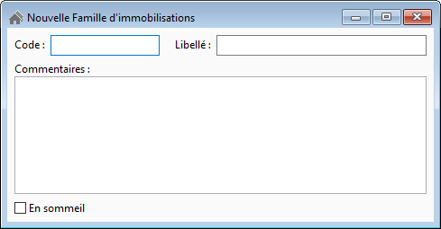

# Famille d'immobilisations

La création d'une nouvelle famille d'immobilisation s'effectue depuis 
 la liste via le menu contextuel "Nouveau", ou "Ctrl + N", 
 ou "Inser".

 

Vous obtenez cette fenêtre :

 

 

Une famille d'immobilisation est identifié par : 

* un code unique
* un libellé
* une zone commentaire

 

Une option vous permet de mettre en sommeil une famille d'immobilisation, 
 afin qu'elle ne soit plus : 

* visible dans la liste des familles d'immobilisations
* sélectionnable dans la fiche immobilisation

