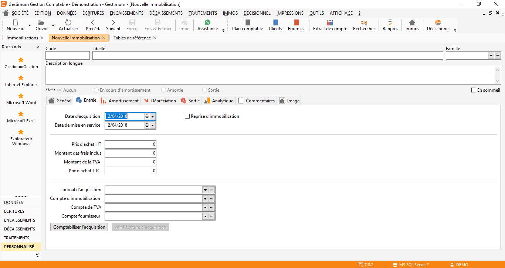
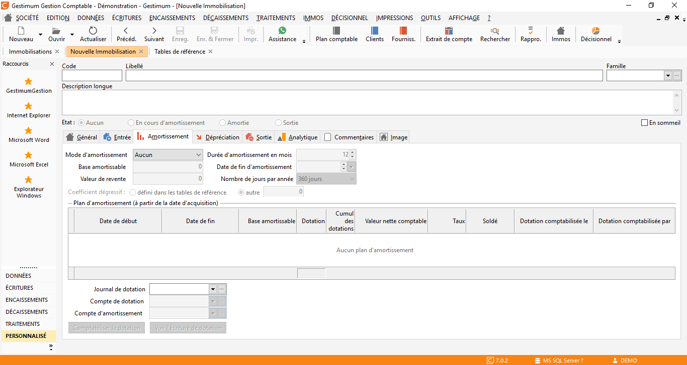
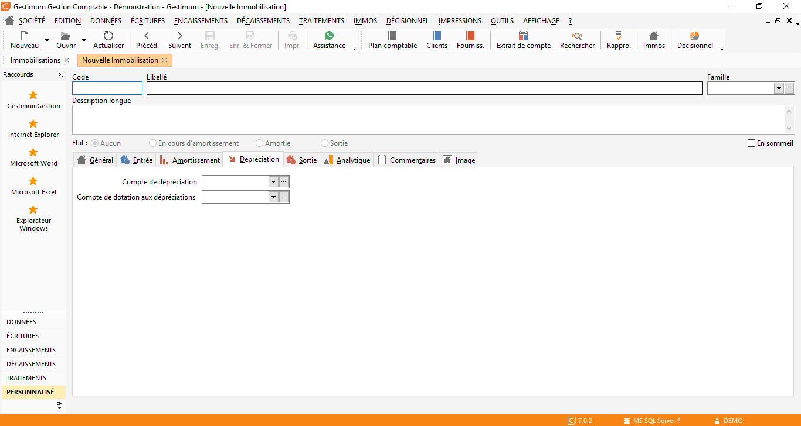
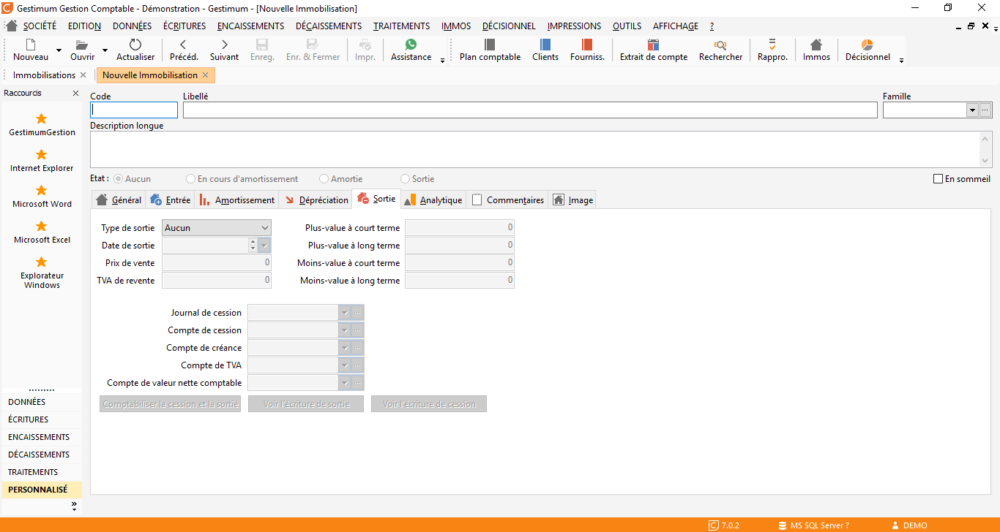
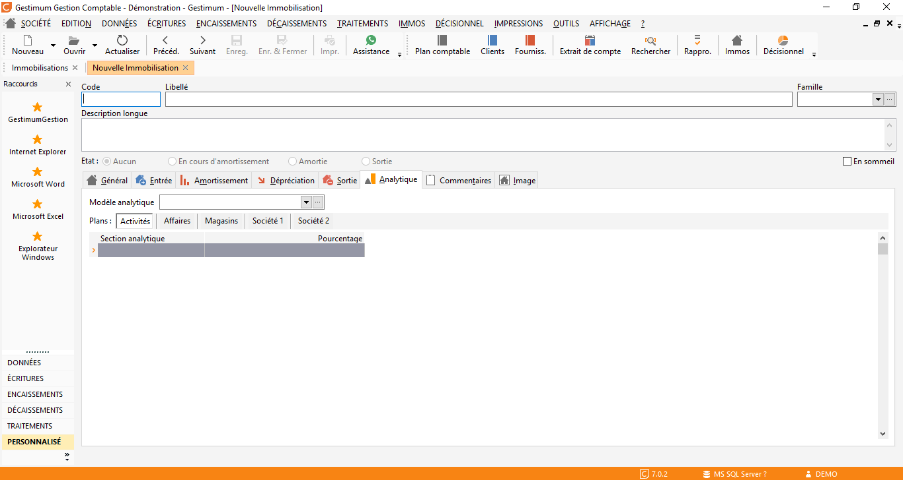
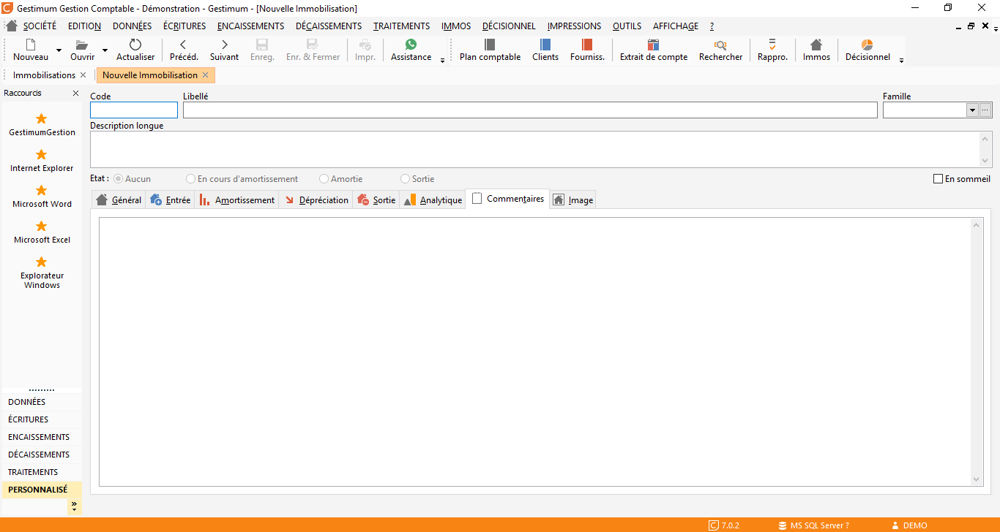
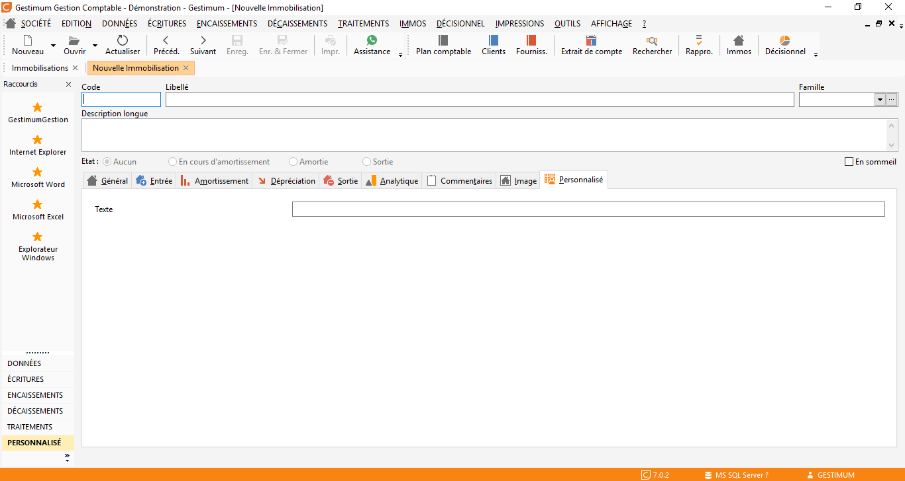

Immobilisations de A à Z

Le module « immobilisations » de la comptabilité GESTIMUM permet d’enregistrer les biens que l'entreprise a choisi de classer en immobilisation, de générer leur plan d’amortissement fiscal, de passer les écritures de dotations de l’exercice et les opérations de sortie des immobilisations de la comptabilité.  

Il permet également de créer et d’utiliser des familles d’immobilisations, ainsi qu’une gestion des lieux succincte et sans historique.  

 La création d’une fiche d’immobilisation peut se faire à partir d’une écriture d’acquisition, à l’aide du menu contextuel. Inversement, il est possible de créer une fiche d’immobilisation et de générer l’écriture d’acquisition correspondante.
 

## Accès aux immobilisations

Ce module est disponible depuis la comptabilité dans IMMOS :

 

## Les données de la fiche d’immobilisation

Une immobilisation comptable est identifiée dans la comptabilité GESTIMUM par :

* Un code unique
* Un libellé
* Une description longue
* Une appartenance à une famille d'immobilisation
* Une position "en sommeil"

 

Elle a un état :

* Aucun,
* En cours d'amortissement : déclenché lors de l'activation du plan d'amortissement,
* Amortie : activé lorsque l'immobilisation est totalement amortie,
* Sortie : activé lorsque l'immobilisation est cédée ou mise au rebut.

Ces valeurs sont mises à jour par le logiciel en fonction des opérations effectuées tout au long de la vie de l’immobilisation.

### L’onglet Général

 

* En Tête de la fiche comprend le code, la désignation et la famille d’immobilisation ainsi qu'un description courte de l'immobilisation
* Le type permet de déterminer s'il s'agit d'un bien, Crédit bail, Location
* La catégorie détermine s'il s'agit d'un bien corporel, incorporel ou financier
* Le code barre, au besoin.
* Le numéro de série, au besoin.
* Le lieu de l’immobilisation, défini via le menu «IMMO – Lieux d’immobilisations»
* Critères 1 à 5 de l’immobilisation, les libellés de ces critères sont définissables depuis les préférences de comptabilité onglet «Immobilisations». Leurs valeurs sont renseignées dans les tables de références
* Date de création, de modification avec l’utilisateur ayant créé ou modifié pour la dernière fois la fiche

### L’onglet Entrée

 

Cet onglet permet de renseigner les éléments constituant l'immobilisation.

 

* La date d’acquisition
* La date de mise en service
* L’option « Reprise d’immobilisation »
* Le prix d’achat
* Le montant des frais inclus : indique la partie des frais contenus dans le montant HT de l’immobilisation (Ex. Frais de mise en service)
* Le montant de la TVA
* Le prix d’achat TTC
* Le Journal comptable enregistrant l’acquisition du bien
* Le compte comptable d’immobilisation auquel le bien a été ou sera imputé
* Le compte de TVA mouvementé lors de l’acquisition
* Le compte du fournisseur de l’immobilisation

### L’onglet Amortissement

 

* Mode d’amortissement fiscale : aucun, linéaire, dégressif.
* Durée d’amortissement en mois.
* Base amortissable de l’immobilisation : par défaut correspond au prix d’achat HT.
* Date de fin d’amortissement.
* Valeur de revente, ce champ est repris lors de la cession de l’immobilisation.
* Nombre de jours par année peut être de 360 ou 365 jours en fonction du mode de calcul choisi. Cette option permet également de s'adapter aux différents mode de calcul des autres logiciels, lors de la reprise de données.
* Coefficient de dégressivité : il y a la possibilité d’appliquer un taux «Automatique ou manuel». Le taux automatique s’appuie sur les coefficients définis dans les tables de références si renseignés, sinon le taux par défaut est appliqué (coefficients 1. 25, 1. 75 Et 2. 25).
* Plan d'amortissement : la modification d’un des champs de cette fenêtre (sauf la valeur de revente) entraîne un recalcule du plan d’amortissement.
* Journal comptable où sont enregistrées les dotations aux amortissements.
* Compte de dotation aux amortissements à employer.
* Compte d'amortissement.
* En bas le bouton «Comptabiliser la dotation» permet de générer l’écriture de dotation aux amortissements sur la période de saisie autorisée. Cet outil est accessible lorsque l’état de l’immobilisation est à l’état «En cours d’amortissement» ou «Reprise d’immobilisation» et que la période correspondant à la période saisissable autorisée n’est pas soldée

### L’onglet Dépréciation

 

Cet onglet permet de renseigner les comptes qui devront être utilisés dans le cas d'une dépréciation de l'immobilisation. Il n'est pas prévu de génération d'écriture de dépréciation depuis le module immobilisations.

NB : le montant des provisions n'est pas disponible

* Compte de dépréciation
* Compte de dotation aux dépréciations

### L’onglet Sortie

* Le type de sortie : mise au rebut ou  cession.
* La date de sortie est à renseigner.
* Le prix de vente :  repris de la fiche immobilisation si renseigné.
* La TVA de revente.
* Plus value à court terme : calculée automatiquement en fonction de la valeur net comptable du bien, de son type de sortie et de sa valeur de vente.
* Plus value à long terme : calculée automatiquement en fonction de la valeur net comptable du bien, de son type de sortie et de sa valeur de vente.
* Moins value à court terme : calculée automatiquement en fonction de la valeur net comptable du bien, de son type de sortie et de sa valeur de vente.
* Moins value à long terme : calculée automatiquement en fonction de la valeur net comptable du bien, de son type de sortie et de sa valeur de vente.
* Journal de cession.
* Compte de cession nécessaires.
* Compte de créance.
* Compte de TVA.
* Compte de la valeur nette comptable.

La comptabilisation des écritures de sortie / cession s'effectue directement depuis cette fenêtre.

### L’onglet Analytique

 

* Ventilation analytique de l’immobilisation, cette ventilation est appliquée lors de la génération des écritures d’acquisition, de cession et de dotation aux amortissements. Elle est unique pour tous les comptes.
* Modèle de ventilation analytique, la ventilation définie dans le modèle est appliqué à tous les comptes comptables associés à la fiche d’immobilisation

### L’onglet commentaires

* Cette partie permet de saisir un commentaire libre sur votre immobilisation

### L’onglet Champs personnalisés

* Les champs personnalisés des immobilisations sont définissables dans le menu Fichier – Paramétrages – Champs personnalisés

## Les outils de traitement en masse

Depuis le menu IMMOS, vous pouvez accéder à 3 outils de comptabilisation en masse :

* Comptabiliser les acquisitions, il est possible de générer des écritures en simulation en cochant l'option mise à disposition dans la fenêtre.

* Comptabiliser les dotations, il est possible de générer des écritures en simulation en cochant l'option mise à disposition dans la fenêtre.

* Comptabiliser les cessions / sorties

## Création d'une fiche d'immobilisation à partir de la saisie des écritures comptables

Sur les lignes d'écriture comptable imputées sur la classe d'immobilisation (dans les racines comptables des préférences société), il est possible de générer une fiche d'immobilisation qui sera liée à la ligne d'écriture. Cette fonction est accessible par le menu contextuel (clic droit)

## Impressions

* Liste des lieux d'immobilisations
* Liste des familles d'immobilisations
* Liste des immobilisations
* Fiches lieu d'immobilisations
* Fiches famille d'immobilisations
* Fiche immobilisations

## L'import d'immobilisations

L'import des immobilisations est disponible à partir du menu OUTILS | Importer | Autres données

 

 

Le format du fichier est un \*.csv séparateur point virgule.

 

