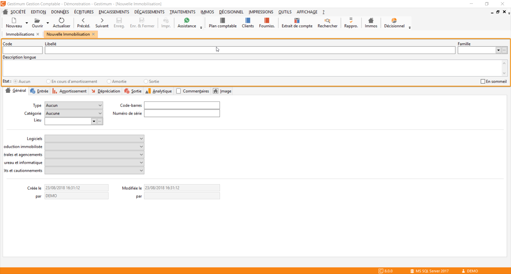

# Entête

Une immobilisation 
 comptable est identifiée dans la comptabilité GESTIMUM par : 

* Un code unique
* Un libellé
* Une description longue
* Une appartenance à une [famille 
 d'immobilisation](../../Familles/FamilleImmobilisations.md)
* Une position "en sommeil"

 

Elle a un état 
 :
* Aucun
* En cours d'amortissement : déclenché lors 
 de l'activation du plan d'amortissement
* Amortie : activé lorsque l'immobilisation 
 est totalement amortie
* Sortie : activé lorsque l'immobilisation 
 est cédée ou mise au rebut

 

Ces valeurs sont mises à jour par le logiciel en fonction des opérations 
 effectuées tout au long de la vie de l’immobilisation.

 

