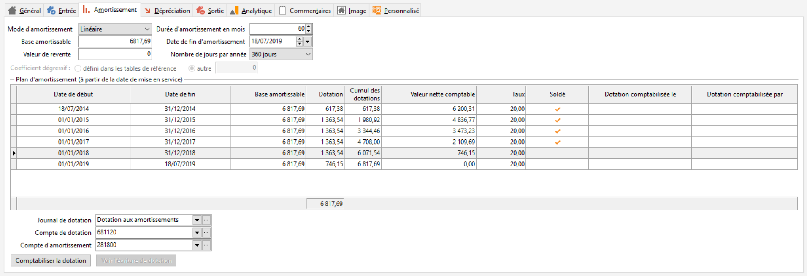

# Amortissement

L'onglet Amortissement permet de déterminer les éléments suivants  :

 

* Mode d’amortissement fiscale : aucun, linéaire, dégressif.
* Durée d’amortissement en mois.
* Base amortissable de l’immobilisation : par défaut correspond au prix d’achat HT renseigné dans l'[onglet Entrée](OngletEntree.md)
* Date de fin d’amortissement : par défaut se calcul à partir de la date de mise en service renseigné dans l'[onglet Entrée](OngletEntree.md) et de la durée d'amortissement en mois que vous avez saisie.
* Valeur de revente, ce champ est repris lors de la cession de l’immobilisation qui s'effectue dans l'[onglet Sortie](OngletSortie.md).
* Nombre de jours par année peut être de 360 ou 365 jours en fonction du mode de calcul choisi. Cette option permet également de s'adapter aux différents mode de calcul des autres logiciels, lors de la reprise de données.
* Coefficient de dégressivité : il y a la possibilité d’appliquer un taux «Automatique ou manuel». Le taux automatique s’appuie sur les coefficients définis dans les tables de références si renseignés, sinon le taux par défaut est appliqué (coefficients 1. 25, 1. 75 Et 2. 25).
* Plan d'amortissement : la modification d’un des champs de cette fenêtre (sauf la valeur de revente) entraîne un recalcule du plan d’amortissement.
* Journal comptable où sont enregistrées les dotations aux amortissements.
* Compte de dotation aux amortissements à employer.
* Compte d'amortissement.

 

La génération du tableau d'amortissement est bloquée dans les cas suivants :

* si l'exercice en cours fait plus de 12 mois
* si les exercices sont décalés par rapport à une année civile.
* si la date de mise en service est antérieure à la date de début de l'exercice en cours.

 

Le logiciel n'a pas assez de données pour calculer un plan d'amortissement cohérent. Vous devez alors passer par l'import de lignes d'amortissement.

 

En bas le bouton «Comptabiliser la dotation» permet de générer l’écriture de dotation aux amortissements sur la période de saisie autorisée. Cet outil est accessible lorsque l’état de l’immobilisation est à l’état «En cours d’amortissement» ou «Reprise d’immobilisation» et que la période correspondant à la période saisissable autorisée n’est pas soldée

 

 

