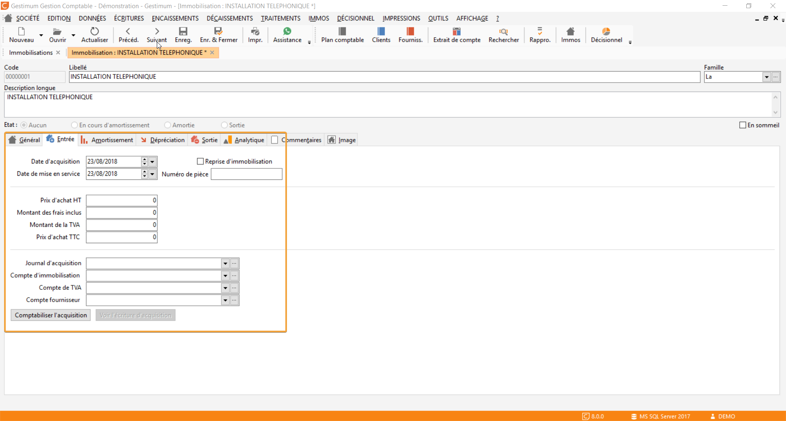

# Entrée

L'onglet Entrée permet de renseigner les éléments constituant l'immobilisation :

 

* La date d’acquisition
* La date de mise en service
* L’option [« Reprise d’immobilisation »](../RepriseImmobilisations.md)
* Le numéro de pièce : zone permettant de saisir le n° de la facture d'achat de l'immobilisation
* La valeur d'acquisition de l'immobilisation :

	+ Le prix d’achat HT
	+ Le montant des frais inclus : indique la partie des frais contenus dans le montant hors taxes de l’immobilisation (Ex. Frais de mise en service)
	+ Le montant de la TVA. Si un compte de TVA sur achat est renseigné dans les éléments comptables, alors le calcul du montant de TVA est calculé à partir du taux paramétré dans le compte de TVA.
	+ Le prix d’achat TTC

* Les éléments comptables :

	+ Le Journal comptable enregistrant l’acquisition du bien
	+ Le compte comptable d’immobilisation auquel le bien a été ou sera imputé
	+ Le compte de TVA mouvementé lors de l’acquisition
	+ Le compte du fournisseur d’immobilisation

 

Il vous est possible de créer et consulter l'[écriture d'acquisition](../../Comptabilisation/GenerationEcrituresComptables.md), directement depuis cet onglet.

 

