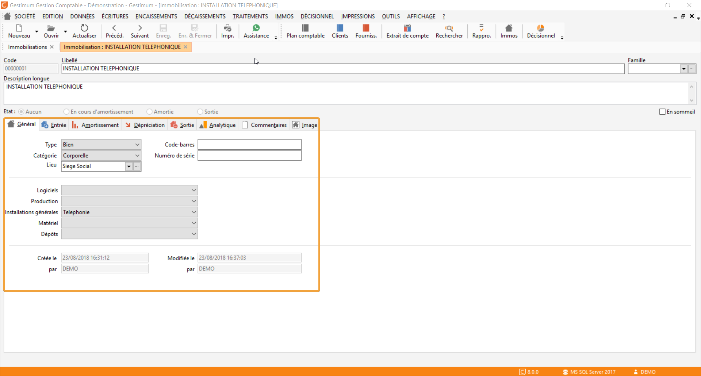

# Général

L'onglet général de la fiche d'immobilisation, permet de définir les 
 éléments suivants : 

 

* Le type d'immobilisation 
 :  un bien, un Crédit bail ou une Location.
* La catégorie d'immobilisation 
 : un bien corporel, incorporel ou financier.
* Le code barre, 
 au besoin.
* Le numéro de série, 
 au besoin.
* Le lieu de l’immobilisation, 
 défini via le menu «IMMO – [Lieux 
 d’immobilisations](../../Lieux/LieuImmobilisations.md)».
* Les critères de 
 1 à 5 de l’immobilisation. Les libellés de ces critères sont définissables 
 depuis les préférences de comptabilité onglet «Immobilisations». Leurs 
 valeurs sont renseignées dans les tables de références.
* Date de création, 
 de modification avec l’utilisateur ayant créé ou modifié pour la dernière 
 fois la fiche.

 

