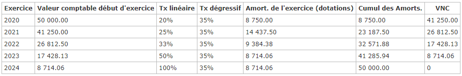
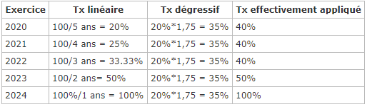

# Amortissement Dégressif

## Calcul de l'amortissement dégressif

#### Caractéristiques de ce mode d'amortissement :

* Le point de départ de l'amortissement dégressif est le premier jour du mois d'acquisition : il n'y a donc **que des mois entiers**
* Pour la première annuité dégressive, on calcule le prorata temporis en mois entiers si le bien a été acquis en cours d'exercice
* La base d'amortissement est la **valeur nette comptable** en début d'exercice
* Le nombre de lignes dans un tableau d'amortissement dégressif est identique au chiffre de la durée de vie, même si le bien est acquis en cours d'exercice (5 ans = 5 lignes)
* Le taux dégressif est égal au taux linéaire multiplié par un coefficient qui est fonction de la durée de vie du bien :

	+ 2-4 ans : 1,25
	+ 5-6 ans : 1,75
	+ + de 6 ans : 2,25
* Lorsque le taux dégressif devient **inférieur** au taux calculé sur le nombre d'exercices restant à courir, on applique alors ce dernier. Donc :

	+ si Taux Dégressif > Taux calculé sur le nombre d'années restant à courir => Appliquer le **Taux Dégressif**
	+ si Taux Dégressif < Taux calculé sur le nombre d'années restant à courir => Appliquer le **Taux calculé sur le nombre d'années restant à courir**

 

**Le fait que le dossier soit calculé sur 360 ou 365 jours n'aura donc aucun impact.**

**Peu importe le nombre de mois dans l'exercice, on reste sur des calculs annualisés sur 12 mois.**

 

Le calcul va donc se déterminer en plusieurs étapes :

1. Déterminer le coefficient d’amortissement dégressif
2. Fixer le taux d'amortissement dégressif permettant de calculer chaque annuité d'amortissement. Pour cela il faut diviser par 100 la durée prévue d'amortissement puis multiplier par le coefficient d'amortissement dégressif. Exemple pour une durée de 3 ans : (100/3)\*1,25
3. Déterminer le montant de la première annuité d'amortissement et des annuités suivantes :

	* **Première annuité** : Prix d'achat \* taux d'amortissement \* Nb de mois restant dans l'année
	* **Annuités suivantes** : Prix d'achat - Annuités déjà déduites \* taux d'amortissement

##### Exemple :

Exercice du 01/01/2020 au 31/12/2020  

 Immobilisation d’une valeur de 50 000 € - amortissement dégressif sur 5 ans – Date de mise en service le 27/06/2020

* Coefficient d’amortissement dégressif : 1,75
* Taux d'amortissement dégressif : (100/5)\*1,75 = 35 %
* Montant de la première annuité : 50 000 \* 35% \* 6/12 = 8750

 

Voici le tableau :

Explication des taux :

=> ici on va passer au taux linéaire sur 2023 car le taux linéaire est supérieur au taux dégressif

