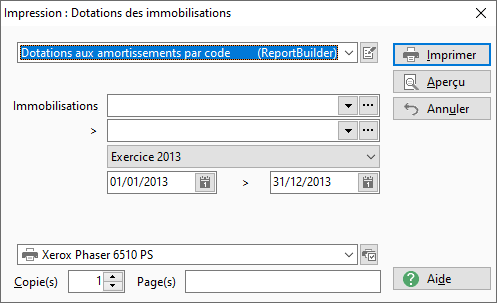
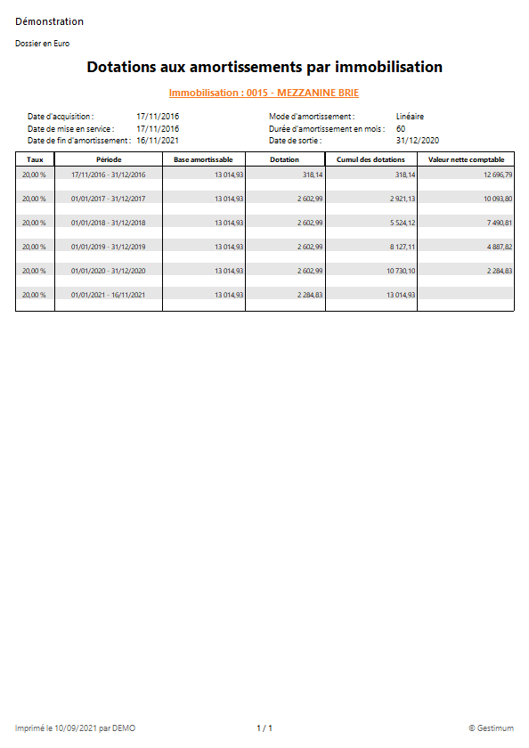
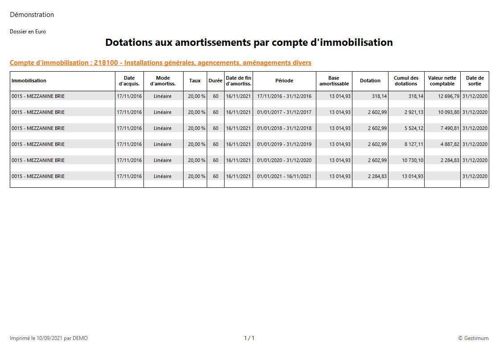

# Impression des dotations
## Options

La fenêtre d'impression des dotations des immobilisations contient les filtres suivants :

1. un intervalle d'immobilisations (de ... à ...)
2. un exercice dans une liste déroulante avec tous les exercices

 

 

Deux modèles vous sont proposées :

* Dotations aux amortissements par code
* Dotations aux amortissements par compte

## Résultat

### Dotations aux amortissements par code

### Dotations aux amortissements par compte

