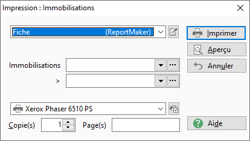
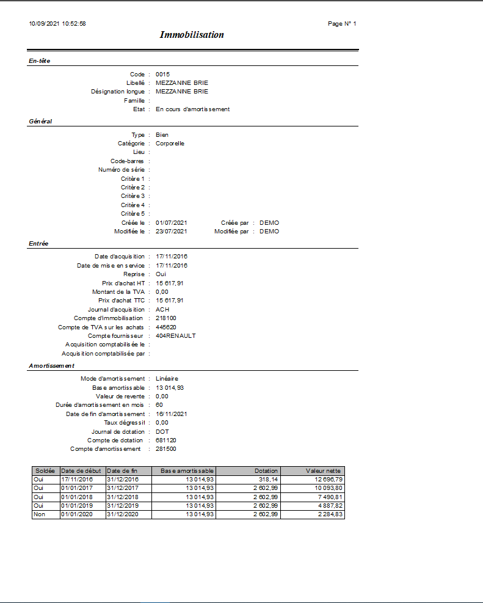
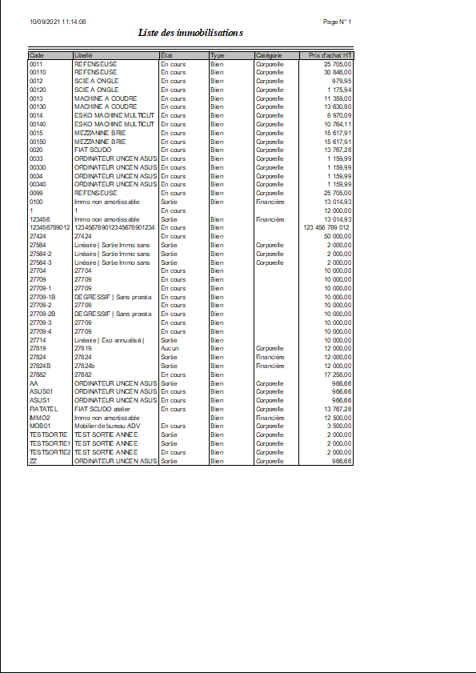

# Impression des immobilisations
## Options

La fenêtre d'impression des immobilisations contient les filtres suivants :

1. un intervalle d'immobilisations (de ... à ...)

 

 

Deux modèles d'impression vous sont proposés :

* La fiche immobilisation
* La liste des immobilisations

## Résultat

Il s'agit de la synthèse de l'immobilisation.

 

 

## La liste des immobilisations

Il s'agit de l'ensemble des immobilisations présentes dans la base sur la période sélectionnée.

