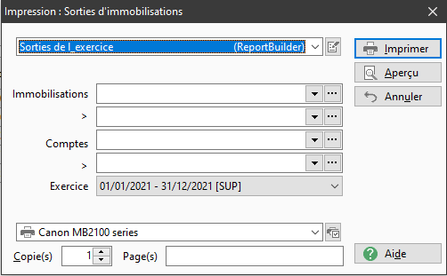

# Impression des sorties d'immobilisations
## Options

La fenêtre d'impression pour les sortie d'immobilisations contient les filtres suivants :

1. un intervalle d'immobilisations (de ... à ...)
2. un intervalle de comptes comptables de classe 2 (de ... à ...)
3. un exercice dans une liste déroulante avec tous les exercices

Vous pouvez choisir soit des immobilisations soit des comptes mais pas les 2 en même temps. 

 

Les liste déroulantes des comptes sont filtrées en utilisant la racine paramétrable dans les préférences.

 

 

## Résultat

 

Cet état comporte l'intégralité des immobilisations sorties au cours de l'exercice sélectionné, et en détermine leurs +/- values.

 

Il est **classé par compte comptable et** **par code immobilisation.**  

 

A la fin de chaque catégorie comptable, il y a un cumul.

 

A la fin de l'état il  y a un cumul global.

## 

 

