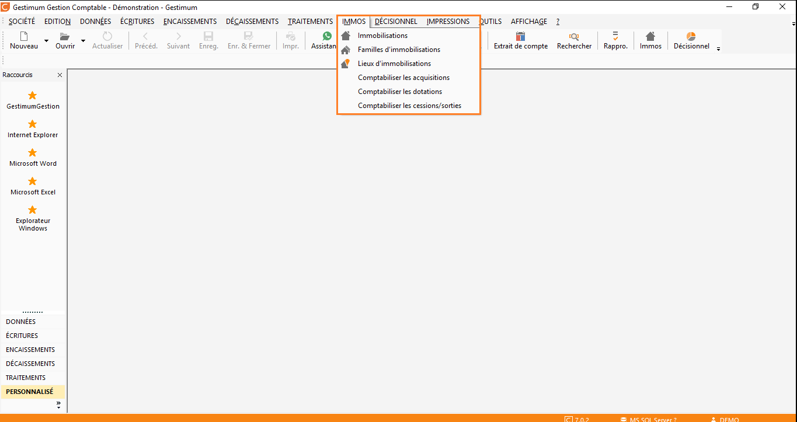

# Introduction

Le module "Immobilisations"  est un module optionnel de Gestimum ERP, accessible depuis la comptabilité via le menu IMMOS.

 

 

Il s'adresse aux entreprises souhaitant répertorier leurs immobilisations et générer les écritures comptables associées.

 

Il permet  :

* de suivre vos acquisitions immobilisées
* de gérer vos actifs
* d'optimiser vos plans d'amortissements
* d'appliquer votre modèle analytique
* de générer et visualiser les écritures comptables
* d'anticiper les sorties d'actifs

 

La création d’une fiche d’immobilisation peut se faire à partir d’une écriture d’acquisition, à l’aide du menu contextuel. Inversement, il est possible de créer une fiche d’immobilisation et de générer l’écriture d’acquisition correspondante depuis le module "Immobilisations".

  

Pour organiser vos immobilisations, vous disposez de différents éléments :

* l'état de l'immobilisation : en cours d'amortissement, amortie, sortie
* la famille personnalisable
* le type : bien, crédit-bail, location
* la catégorie : corporelle, incorporelle, financière
* le lieu personnalisable
* les 5 critères personnalisables
* les champs personnalisés

 

 &amp;lt;p&amp;gt;&amp;amp;#160;&amp;lt;/p&amp;gt;
 

