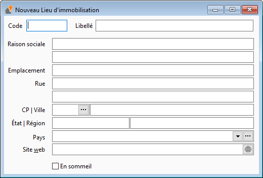

# Lieu d'immobilisations

La création d'un nouveau lieu d'immobilisation s'effectue depuis la 
 liste via le menu contextuel "Nouveau", ou "Ctrl + N", 
 ou "Inser".

 

Vous obtenez cette fiche : 

 

 

Un lieu d'immobilisation est identifié par : 

* un code unique
* un libellé
* une adresse complète

 

Une option vous permet de mettre en sommeil un lieu d'immobilisation, 
 afin qu'il ne soit plus : 

* visible dans la liste des lieux d'immobilisations
* sélectionnable dans la fiche immobilisation

