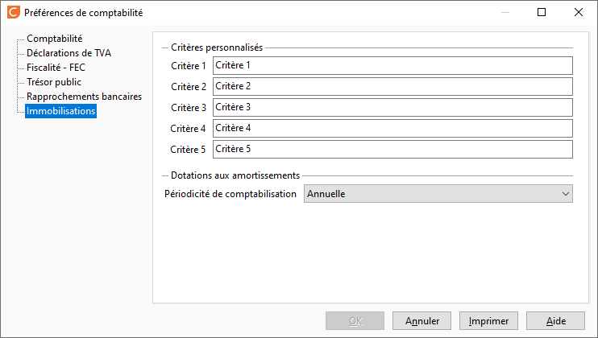

# Préférences

 

Il est possible de définir 5 critères vous permettant d'ajouter des informations complémentaires afin que votre base immobilisations réponde aux caractéristiques propres à votre activité. Ici il s'agit de nommer chaque critère, pour ensuite venir enrichir leur menu déroulant dans [les tables de référence](http://docs.gestimum.com/ERP/9.4/mergedProjects/Societe/tablesreferences/2/tablestiers.md).

 

Vous pouvez déterminer une périodicité de comptabilisation des dotations aux amortissements :

* Annuelle
* Mensuelle
* Semestrielle
* Trimestrielle

Il est à noter que ce paramétrage vous générera les écriture en une seule fois, en respectant la périodicité choisie.

