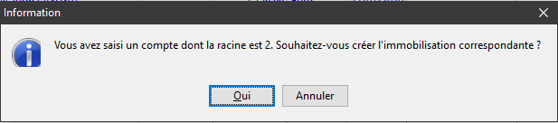
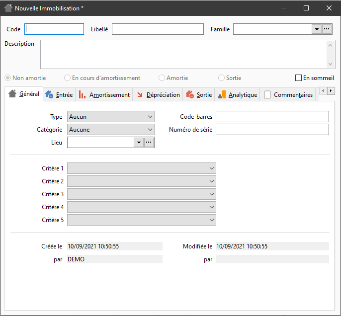
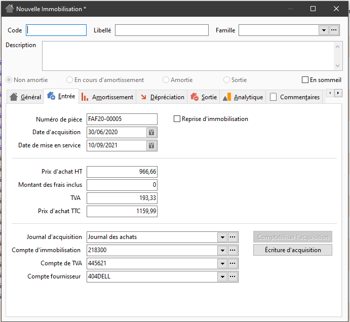

# Création d'une immobilisation depuis une écriture comptable
Sur les lignes d'écriture comptable imputées sur la classe d'immobilisation (dans les racines comptables des préférences société), il est possible de générer une fiche d'immobilisation qui sera liée à la ligne d'écriture.

 

La fenêtre de création vous est proposée par Gestimum ERP dès qu'une écriture d'acquisition d'immobilisation équilibrée est détéctée :

 

 

En cliquant sur "Oui" une nouvelle fiche immobilisation s'ouvre :

 

 

Avec l'onglet "Entrée" pré-rempli :

 

 

Cette fonction est également accessible par le menu contextuel (clic droit) depuis l'écriture comptable.

