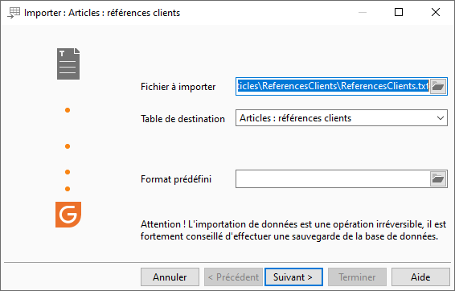
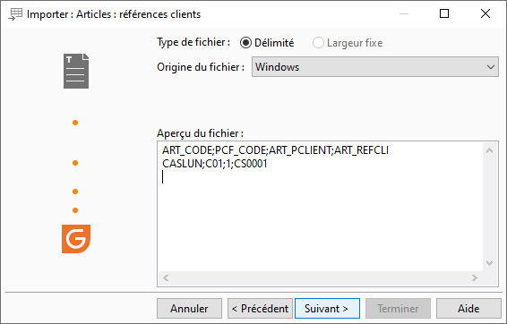
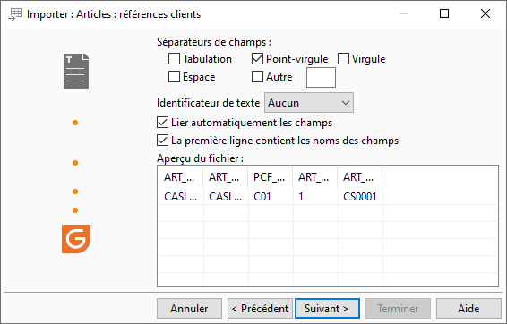
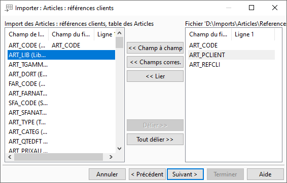
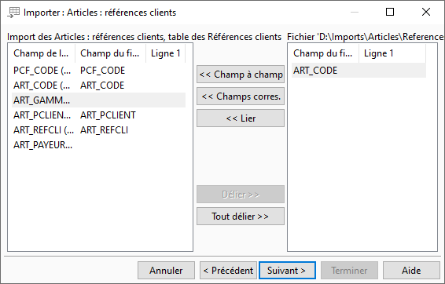
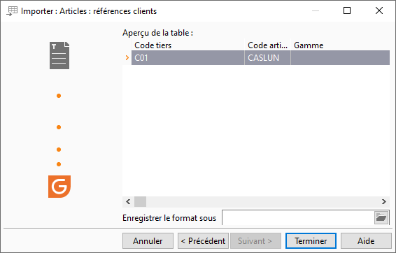

# Exemple d'import de références clients d'articles seules
## Fichier à importer

## Type de fichier

## Séparateur de champs

## Correspondance

 

## Aperçu avant import

## Rapport de fin

L'import a été effectué avec succès.

Nombre de lignes importées : 1

Nombre de lignes non importées : 0

