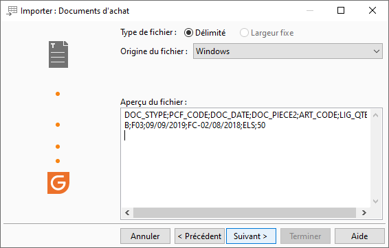
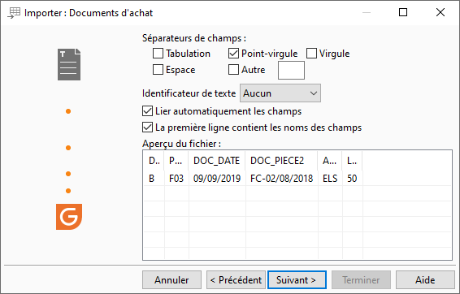
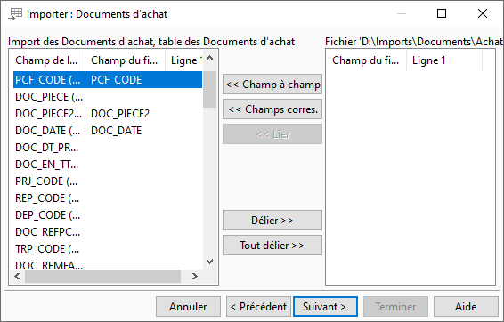
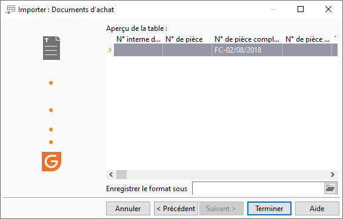

# Exemple d'import de documents d'achat
## Fichier à importer

## Type de fichier

## Séparateur de champs

## Correspondance

## Aperçu avant import

## Rapport de fin

L'import a été effectué avec succès.

Nombre de lignes importées : 1

Nombre de lignes non importées : 0

Ligne 2 : La date de livraison n'est pas valide

La pièce BLF19-00009 a été créée

